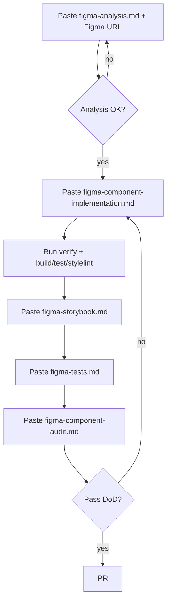

# AI Prompt Templates (Figma MCP → Andy UI)

**Purpose:** Reusable, deterministic prompts for **Cursor Auto** when building or reviewing UI from the [Andy UI Figma file](https://www.figma.com/design/TcEuJHlNPkME9br19X1Qhx/Andy-UI---Design-System).

**Governance (do not duplicate here):**

- [../../standards/figma-integration.md](../../standards/figma-integration.md) — Figma MCP workflow, tokens, DoD
- [../../standards/component-verification.md](../../standards/component-verification.md) — verify targets and CI
- [../../.cursor/rules.md](../../.cursor/rules.md) — mandatory doc review order
- [../overview.md](../overview.md) — monorepo architecture

---

## Prompt catalog

| File | Use when | Output |
|------|----------|--------|
| [figma-analysis.md](./figma-analysis.md) | Starting a new component or major variant change | Analysis only — **no code** |
| [figma-component-implementation.md](./figma-component-implementation.md) | Ready to implement after analysis is approved | Code + verification + doc updates |
| [figma-component-audit.md](./figma-component-audit.md) | Reviewing existing implementation vs Figma | Audit report + fix list |
| [figma-storybook.md](./figma-storybook.md) | Adding or updating Storybook | `*.stories.ts` aligned to Figma |
| [figma-tests.md](./figma-tests.md) | Adding unit + e2e test coverage | Specs + Playwright guidance |

---

## Recommended Cursor Auto workflow



### Step-by-step

1. **Analysis** — Use `figma-analysis.md` with a **node-specific** Figma URL (`node-id` required). Review the AI output before any code.
2. **Implementation** — Use `figma-component-implementation.md` in a **new** Auto session or after analysis is in context. One component per session when possible.
3. **Storybook** — Use `figma-storybook.md` after the Stencil component exists.
4. **Tests** — Use `figma-tests.md` for unit specs and Playwright tags.
5. **Audit** — Use `figma-component-audit.md` before opening a PR (or when reviewing someone else's PR).

### One-liner invocation

In Cursor chat, reference the file instead of pasting the full body:

```text
Follow docs/ai-context/prompts/figma-analysis.md for this task.
Figma URL: https://www.figma.com/design/TcEuJHlNPkME9br19X1Qhx/Andy-UI---Design-System?node-id=14-4&m=dev
Component: button
```

---

## Best practices for Auto mode

- **Attach the Figma URL** in every prompt; extract `fileKey` `TcEuJHlNPkME9br19X1Qhx` and `nodeId` (`14-4` → `14:4`).
- **Analysis before code** — Never skip `figma-analysis.md` for new publishable components.
- **Scope one component** — Reduces cross-file drift and token mistakes.
- **Do not paste Figma MCP CSS** into the repo — prompts enforce token mapping.
- **Run verification yourself** — AI must run commands; confirm exit codes in the terminal.
- **Stop on conflicts** — If docs contradict code, report and pause (see `.cursor/rules.md`).
- **Promote publishable tier** — Add component id to `PUBLISHABLE_COMPONENTS` in `tools/scripts/ui-component-verify/constants.mjs` when it meets DoD.

### Development commands (after implementation)

```bash
corepack pnpm nx run @omnifex/ui-components:build
corepack pnpm nx run @omnifex/ui-components:test
corepack pnpm nx run @omnifex/ui-components:stylelint
corepack pnpm nx run @omnifex/ui-components:storybook
corepack pnpm nx run @omnifex/ui-components:verify:button   # when publishable
```

---

## Figma MCP quick reference

| Step | Tool | Notes |
|------|------|--------|
| Structure | `get_metadata` | Parent frame if URL points at gradient/swatches |
| Variables | `get_variable_defs` | On scale frame, not decorative children |
| Visual + reference | `get_design_context` | Sub-symbols if frame is too large |

`clientLanguages`: `typescript,css` · `clientFrameworks`: `angular,react`

---

## When to update governance docs

Update [figma-integration.md](../../standards/figma-integration.md) or [component-verification.md](../../standards/component-verification.md) only when rules or verify behavior change — not for every component. Component-level detail belongs in `libs/ui-components/src/lib/<name>/readme.md`.
