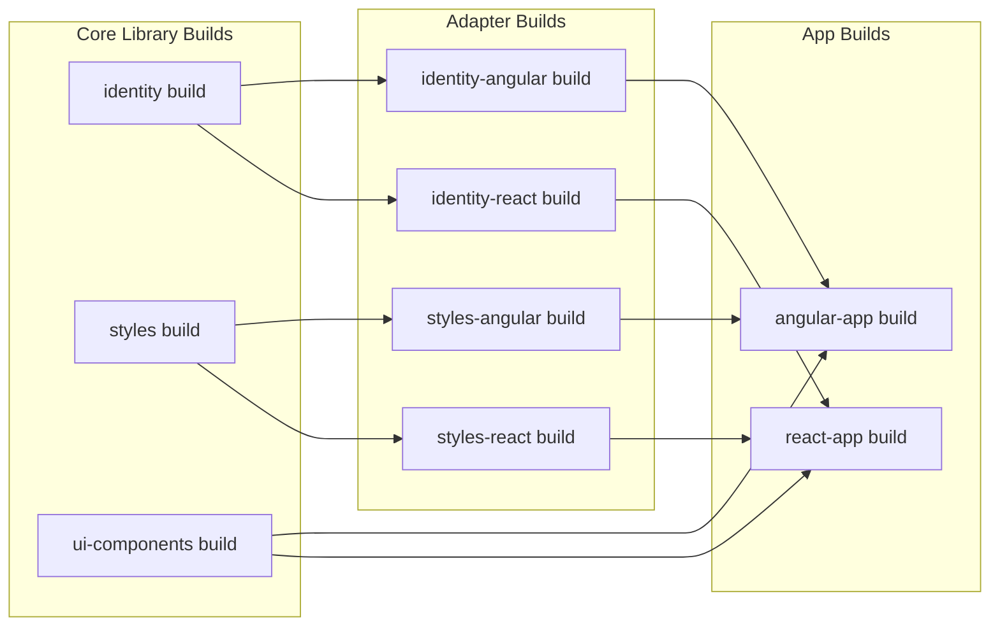

# Architecture

## Nx Project Graph

The Omnifex UI monorepo is organized as a directed acyclic graph (DAG) of projects, where dependencies flow in one direction: from apps to adapters to core libraries.

```mermaid
graph TD
    AngularApp[angular-app]
    ReactApp[react-app]
    
    IdentityAngular[@omnifex/identity-angular]
    IdentityReact[@omnifex/identity-react]
    StylesAngular[@omnifex/styles-angular]
    StylesReact[@omnifex/styles-react]
    
    Identity[@omnifex/identity]
    Styles[@omnifex/styles]
    UIComponents[@omnifex/ui-components]
    
    AngularApp --> IdentityAngular
    AngularApp --> StylesAngular
    AngularApp --> UIComponents
    
    ReactApp --> IdentityReact
    ReactApp --> StylesReact
    ReactApp --> UIComponents
    
    IdentityAngular --> Identity
    IdentityReact --> Identity
    
    StylesAngular --> Styles
    StylesReact --> Styles
```

### Graph Properties

1. **No Circular Dependencies**: The graph is acyclic, preventing build order issues
2. **Clear Layers**: Apps → Adapters → Core → External packages
3. **Shared Components**: `ui-components` is consumed by both apps
4. **Framework Isolation**: Angular and React apps don't depend on each other's adapters

### Viewing the Graph

```bash
# Interactive visualization
corepack pnpm nx graph

# Focus on a specific project
corepack pnpm nx graph --focus=angular-app

# See affected projects
corepack pnpm nx affected:graph
```

## Dependency Rules

### Layer 1: Core Libraries (Framework-Agnostic)

**Packages**: `identity`, `styles`, `ui-components`

**Rules**:
- MUST NOT import from Angular or React
- MUST NOT import from framework adapters
- MAY import from other core libraries
- MAY import from external npm packages (oidc-client-ts, etc.)
- MUST be written in pure TypeScript

**Purpose**: Contain business logic that works across all frameworks

**Example** (`libs/identity/src/lib/auth.service.ts`):
```typescript
// ✅ Allowed: Pure TypeScript, external package
import { UserManager, User } from 'oidc-client-ts';

// ❌ Not allowed: Framework imports
// import { inject, signal } from '@angular/core';
// import { useState } from 'react';

let userManager: UserManager | null = null;

export function initAuth(config: AuthConfig): void {
  userManager = new UserManager(config);
}

export function getAuthService(): AuthService {
  if (!userManager) {
    throw new Error('AuthService not initialized');
  }
  return {
    getUser: () => userManager!.getUser(),
    login: () => userManager!.signinRedirect(),
    // ...
  };
}
```

### Layer 2: Framework Adapters

**Packages**: `identity-angular`, `identity-react`, `styles-angular`, `styles-react`

**Rules**:
- MUST import from corresponding core library
- MAY import framework-specific APIs (Angular, React)
- MUST NOT depend on other adapters
- MUST wrap core APIs with framework idioms

**Purpose**: Provide framework-native APIs for core functionality

**Angular Adapter** (`libs/identity-angular/src/lib/auth.service.ts`):
```typescript
import { Injectable, signal, inject } from '@angular/core';
import { getAuthService, type User } from '@omnifex/identity';

@Injectable({ providedIn: 'root' })
export class AuthService {
  private core = getAuthService();
  
  // Angular signal
  user = signal<User | null>(null);
  
  constructor() {
    this.core.getUser().then(user => this.user.set(user));
  }
  
  async login(): Promise<void> {
    await this.core.login();
  }
}
```

**React Adapter** (`libs/identity-react/src/useAuth.tsx`):
```typescript
import { createContext, useContext, useState, useEffect } from 'react';
import { getAuthService, type User } from '@omnifex/identity';

const AuthContext = createContext<AuthContextValue | null>(null);

export function AuthProvider({ children }: Props) {
  const [user, setUser] = useState<User | null>(null);
  const core = getAuthService();
  
  useEffect(() => {
    core.getUser().then(setUser);
  }, []);
  
  return (
    <AuthContext.Provider value={{ user, core }}>
      {children}
    </AuthContext.Provider>
  );
}

export function useAuth() {
  const context = useContext(AuthContext);
  if (!context) throw new Error('useAuth must be used within AuthProvider');
  return context;
}
```

### Layer 3: Applications

**Packages**: `angular-app`, `react-app`

**Rules**:
- MUST import from adapters (not directly from core)
- MAY import from `ui-components`
- MUST NOT import from other apps
- MAY use any framework-specific APIs

**Purpose**: Implement application-specific features and UI

## Build Strategy

### Development Mode (Source-Based)

During development, applications consume library source code directly via TypeScript path mappings:

```typescript
// tsconfig.base.json
{
  "compilerOptions": {
    "paths": {
      "@omnifex/identity": ["./libs/identity/src/public-api.ts"],
      "@omnifex/identity-angular": ["./libs/identity-angular/src/public-api.ts"],
      // ...
    }
  }
}
```

**Benefits**:
- Fast rebuilds (no library compilation needed)
- Instant type checking
- Better debugging experience
- Hot module replacement works across libraries

**Webpack/Vite Configuration**:
- Angular uses Vite with `resolve.alias` pointing to source
- React uses webpack with custom `config-overrides.js` for aliases

### Production Mode (Dist-Based)

For production builds, libraries are compiled to `dist/` and apps consume the built output:



**Build Order** (enforced by `dependsOn` in `project.json`):

1. Core libraries (`identity`, `styles`, `ui-components`)
2. Angular adapters (`identity-angular`, `styles-angular`)
3. React adapters (`identity-react`, `styles-react`)
4. Applications (`angular-app`, `react-app`)

**Example `project.json`**:
```json
{
  "name": "@omnifex/identity-angular",
  "targets": {
    "build": {
      "executor": "@nx/angular:ng-packagr-lite",
      "dependsOn": ["@omnifex/identity:build"]
    }
  }
}
```

When you run `nx build angular-app`, Nx automatically builds all dependencies first.

### Dual TypeScript Configuration

The monorepo uses two TypeScript configurations to support both development and production:

**`tsconfig.base.json`** (Development):
```json
{
  "compilerOptions": {
    "paths": {
      "@omnifex/identity": ["./libs/identity/src/public-api.ts"]
    }
  }
}
```

**`tsconfig.ng-packagr.json`** (Production builds for Angular libraries):
```json
{
  "extends": "./tsconfig.base.json",
  "compilerOptions": {
    "paths": {
      "@omnifex/identity": ["./dist/identity/src/public-api.js"]
    }
  }
}
```

Angular libraries use `ng-packagr` which enforces strict `rootDir` rules, requiring built dependencies.

## Why Split identity/styles?

### Problem: Framework Lock-In

If authentication logic is written inside Angular or React, it cannot be reused:

```typescript
// ❌ Angular-specific, can't use in React
@Injectable()
export class AuthService {
  private userManager = new UserManager(config);
  user = signal<User | null>(null);
  
  login() {
    this.userManager.signinRedirect();
  }
}
```

### Solution: Framework-Agnostic Core

Extract the logic into pure TypeScript:

```typescript
// ✅ Pure TypeScript, works everywhere
export function getAuthService() {
  return {
    getUser: () => userManager.getUser(),
    login: () => userManager.signinRedirect()
  };
}
```

Then create framework-specific adapters that wrap this core:

**Angular**: Wraps with `@Injectable`, signals, and DI
**React**: Wraps with Context, hooks, and state
**Vue**: Could wrap with Composition API and refs
**Svelte**: Could wrap with stores

### Benefits

1. **Single Source of Truth**
   - Auth logic tested once
   - Bug fixes apply to all frameworks
   - Behavior guaranteed consistent

2. **Easier Testing**
   - Core library tested with pure TypeScript
   - No framework mocking required
   - Adapters tested with framework-specific tools

3. **Future-Proof**
   - New framework support = new adapter only
   - Core logic never changes
   - Minimal maintenance burden

4. **Type Safety**
   - TypeScript interfaces shared across adapters
   - Compiler ensures API compatibility
   - Refactoring confidence

## Module Resolution

### TypeScript Path Mappings

All projects extend `tsconfig.base.json` which defines path mappings:

```json
{
  "compilerOptions": {
    "baseUrl": ".",
    "paths": {
      "@omnifex/identity": ["./libs/identity/src/public-api.ts"],
      "@omnifex/identity-angular": ["./libs/identity-angular/src/public-api.ts"]
    }
  }
}
```

Apps and tests use these paths to resolve imports to source files.

### Webpack Resolution (React)

React app uses `react-app-rewired` with custom webpack config:

```javascript
// apps/react-app/config-overrides.js
module.exports = function override(config) {
  config.resolve.alias = {
    '@omnifex/identity': path.resolve(__dirname, '../../libs/identity/src/public-api.ts'),
    '@omnifex/identity-react': path.resolve(__dirname, '../../libs/identity-react/src/public-api.ts'),
  };
  
  // Map .js imports to .ts files (TypeScript ESM)
  config.resolve.extensionAlias = {
    '.js': ['.ts', '.tsx', '.js'],
  };
  
  return config;
};
```

### Vite Resolution (Angular)

Angular app uses Vite with custom aliases:

```typescript
// apps/angular-app/vite.config.ts
export default defineConfig({
  resolve: {
    alias: {
      '@omnifex/identity': resolve(__dirname, '../../libs/identity/src'),
      '@omnifex/identity-angular': resolve(__dirname, '../../libs/identity-angular/src'),
    },
  },
});
```

## Package Management with pnpm

### Workspace Protocol

All local dependencies use `workspace:*`:

```json
{
  "dependencies": {
    "@omnifex/identity": "workspace:*",
    "@omnifex/identity-angular": "workspace:*"
  }
}
```

During development, pnpm creates symlinks to source directories. For publishing, `workspace:*` is replaced with actual version numbers.

### Version Overrides

The root `package.json` uses `pnpm.overrides` to enforce consistent versions:

```json
{
  "pnpm": {
    "overrides": {
      "react": "18.2.0",
      "react-dom": "18.2.0"
    }
  }
}
```

This prevents version conflicts when different packages request different versions.

## Build Tools

### Core Libraries

- **`@omnifex/identity`**: Built with `@nx/js:tsc` (TypeScript compiler)
- **`@omnifex/styles`**: Built with `@nx/js:tsc`
- **`@omnifex/ui-components`**: Built with Stencil compiler

### Angular Adapters

- **`@omnifex/identity-angular`**: Built with `@nx/angular:ng-packagr-lite`
- **`@omnifex/styles-angular`**: Built with `@nx/angular:ng-packagr-lite`

ng-packagr compiles Angular libraries to Angular Package Format (APF), which includes ES2022, ES2020, and UMD bundles plus TypeScript definitions.

### React Adapters

- **`@omnifex/identity-react`**: Built with `@nx/js:tsc`
- **`@omnifex/styles-react`**: Built with `@nx/js:tsc`

### Applications

- **`angular-app`**: Built with `@nx/angular:application` (Vite-based)
- **`react-app`**: Built with `react-scripts` (Webpack 5, CRA 5)

## Task Caching

Nx caches task outputs based on inputs:

```json
{
  "targetDefaults": {
    "build": {
      "inputs": ["production", "^production"],
      "cache": true
    }
  }
}
```

**Inputs** include:
- Source files in the project
- Configuration files (tsconfig.json, project.json)
- Dependencies' outputs (^production)

**Cache Key**: SHA256 hash of all inputs

**Cache Hit**: If inputs haven't changed, Nx restores outputs from cache (instant builds)

## Next Steps

- **Apps**: Learn how applications structure and use libraries in [apps.md](./apps.md)
- **Packages**: Explore each library's API in [packages.md](./packages.md)
- **Build & CI**: Deep dive into build optimization in [build-and-ci.md](./build-and-ci.md)

