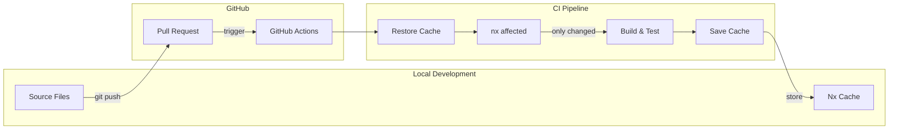
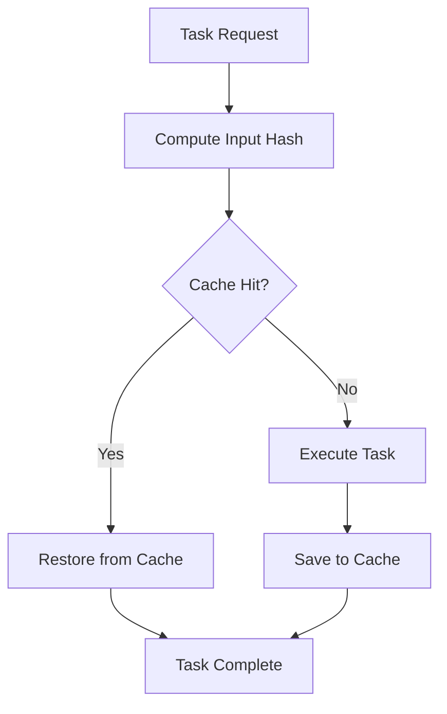

# Build and CI/CD

## Overview

The Omnifex UI monorepo uses Nx for intelligent build orchestration and GitHub Actions for continuous integration. The key advantage is **`nx affected`** - only building and testing projects that are affected by changes, dramatically reducing CI time.



## Local Build Strategy

### Development Mode (Source-Based)

During development, applications consume library source code directly via TypeScript path mappings and webpack/Vite aliases. No build step is required:

```typescript
// tsconfig.base.json
{
  "compilerOptions": {
    "paths": {
      "@omnifex/identity": ["./libs/identity/src/public-api.ts"],
      "@omnifex/identity-angular": ["./libs/identity-angular/src/public-api.ts"]
    }
  }
}
```

**Benefits**:
- **Fast Feedback**: Changes reflect immediately
- **Hot Module Replacement**: Works across libraries
- **Easy Debugging**: Source maps point to actual TypeScript
- **No Build Steps**: Faster development cycle

**Commands**:
```bash
# Serve Angular app (no library builds needed)
corepack pnpm nx serve angular-app

# Serve React app (no library builds needed)
corepack pnpm nx serve react-app
```

### Production Mode (Dist-Based)

For production builds, libraries are compiled to `dist/` and apps consume the built output:

```bash
# Build everything (Nx determines correct order)
corepack pnpm nx run-many -t build --all

# Build specific app (Nx builds dependencies first)
corepack pnpm nx build angular-app

# Build only what changed
corepack pnpm nx affected -t build
```

**Build Order** (enforced by `dependsOn`):
1. Core libraries: `identity`, `styles`, `ui-components`
2. Angular adapters: `identity-angular`, `styles-angular`
3. React adapters: `identity-react`, `styles-react`
4. Applications: `angular-app`, `react-app`

## Nx Affected Commands

### How It Works

Nx analyzes git history to determine which projects are affected by changes:

```bash
# Compare current branch against main
git diff main...HEAD

# Nx builds project graph and finds affected projects
nx affected:graph

# Run tasks only for affected projects
nx affected -t build
nx affected -t test
nx affected -t lint
```

### Example Scenario

**Change**: Update `libs/identity/src/lib/auth.service.ts`

**Affected Projects**:
- `@omnifex/identity` (changed directly)
- `@omnifex/identity-angular` (depends on identity)
- `@omnifex/identity-react` (depends on identity)
- `angular-app` (depends on identity-angular)
- `react-app` (depends on identity-react)

**Not Affected**:
- `@omnifex/styles` (no dependency on identity)
- `@omnifex/styles-angular` (no dependency on identity)
- `@omnifex/styles-react` (no dependency on identity)
- `@omnifex/ui-components` (no dependency on identity)

**CI Command**:
```bash
# Only builds/tests affected projects
nx affected -t lint,test,build
```

This could reduce CI time from 10 minutes to 2 minutes!

### Affected Commands

| Command | Purpose |
|---------|---------|
| `nx affected:graph` | Visualize affected projects |
| `nx affected -t build` | Build affected projects |
| `nx affected -t test` | Test affected projects |
| `nx affected -t lint` | Lint affected projects |
| `nx affected -t lint,test,build` | Run multiple targets |

### Base Branch Configuration

```json
// nx.json
{
  "defaultBase": "main"
}
```

Nx compares current branch against `main` to determine affected projects.

## Task Caching

### How Caching Works

Nx caches task outputs based on inputs:

1. **Compute Hash**: SHA256 of all inputs (source files, configs, dependencies)
2. **Check Cache**: If hash exists, restore outputs from cache
3. **Execute or Restore**: Run task only if cache miss
4. **Store Outputs**: Save outputs to cache for future runs



### Cache Configuration

```json
// nx.json
{
  "targetDefaults": {
    "build": {
      "cache": true,
      "inputs": ["production", "^production"],
      "outputs": ["{workspaceRoot}/dist/{projectRoot}"]
    },
    "test": {
      "cache": true,
      "inputs": ["default", "^production"]
    }
  }
}
```

**Inputs**:
- `default`: All files in project directory
- `production`: Production files (excludes tests)
- `^production`: Production files of dependencies

**Outputs**:
- Directories to cache (e.g., `dist/identity`)

### Cache Benefits

**Local Development**:
```bash
# First build: 45 seconds
nx build angular-app

# No changes, second build: instant!
nx build angular-app
# > Nx read the output from cache

# Change one file: only rebuilds affected
```

**CI Pipeline**:
```bash
# First PR build: 3 minutes
# Subsequent PR builds with cache: 30 seconds
```

### Cache Location

- **Local**: `.nx/cache/`
- **Remote** (optional): Nx Cloud (not configured in this repo)

### Clearing Cache

```bash
# Clear Nx cache
nx reset

# Or manually delete
rm -rf .nx/cache
```

## GitHub Actions CI/CD

### Workflow Configuration

```yaml
# .github/workflows/ci.yml
name: CI

on:
  push:
    branches: [main]
  pull_request:
    branches: [main]

jobs:
  ci:
    runs-on: ubuntu-latest
    
    steps:
      - name: Checkout
        uses: actions/checkout@v4
        with:
          fetch-depth: 0  # Fetch all history for nx affected
      
      - name: Setup Node.js
        uses: actions/setup-node@v4
        with:
          node-version: '20'
      
      - name: Enable Corepack
        run: corepack enable
      
      - name: Install pnpm
        run: corepack prepare pnpm@10.26.2 --activate
      
      - name: Get pnpm store directory
        id: pnpm-cache
        shell: bash
        run: |
          echo "STORE_PATH=$(pnpm store path)" >> $GITHUB_OUTPUT
      
      - name: Setup pnpm cache
        uses: actions/cache@v3
        with:
          path: ${{ steps.pnpm-cache.outputs.STORE_PATH }}
          key: ${{ runner.os }}-pnpm-store-${{ hashFiles('**/pnpm-lock.yaml') }}
          restore-keys: |
            ${{ runner.os }}-pnpm-store-
      
      - name: Install dependencies
        run: pnpm install --frozen-lockfile
      
      - name: Derive appropriate SHAs for base and head
        uses: nrwl/nx-set-shas@v4
      
      - name: Lint affected projects
        run: pnpm nx affected -t lint --parallel=3
      
      - name: Test affected projects
        run: pnpm nx affected -t test --parallel=3 --configuration=ci
      
      - name: Build affected projects
        run: pnpm nx affected -t build --parallel=3
```

### Key Features

1. **Fetch Depth 0**: Fetch full git history for accurate affected detection
2. **pnpm Cache**: Cache pnpm store for faster installs
3. **Nx SHAs**: Automatically determine base and head commits
4. **Parallel Execution**: Run multiple tasks in parallel (`--parallel=3`)
5. **Affected Commands**: Only run tasks for changed projects

### Cache Strategy

**Two-Level Caching**:

1. **pnpm Cache**: Dependencies cached by lock file hash
   ```yaml
   key: ${{ runner.os }}-pnpm-store-${{ hashFiles('**/pnpm-lock.yaml') }}
   ```

2. **Nx Task Cache**: Task outputs cached by Nx
   - Stored in `.nx/cache/`
   - Persists between workflow runs

### Workflow Optimization

**Before Optimization** (No Nx, No Cache):
```
Install deps:  2 minutes
Lint all:      3 minutes
Test all:      4 minutes
Build all:     5 minutes
Total:         14 minutes
```

**After Optimization** (Nx Affected + Cache):
```
Install deps:  30 seconds (cached)
Lint affected: 1 minute   (only changed)
Test affected: 1 minute   (only changed)
Build affected: 2 minutes (only changed)
Total:         4.5 minutes
```

**Savings**: 67% faster CI pipeline!

## Build Artifacts

### Output Directories

```
dist/
├── apps/
│   ├── angular-app/          # Angular production build
│   │   ├── browser/
│   │   │   ├── index.html
│   │   │   ├── main-*.js
│   │   │   └── styles-*.css
│   │   └── server/
│   └── react-app/            # React production build
│       └── build/
│           ├── index.html
│           ├── static/
│           └── asset-manifest.json
├── identity/                 # Core library ESM + types
│   ├── src/
│   │   ├── public-api.js
│   │   └── public-api.d.ts
│   └── package.json
├── identity-angular/         # Angular library APF
│   ├── esm2022/
│   ├── fesm2022/
│   ├── public-api.d.ts
│   └── package.json
└── ui-components/            # Stencil web components
    ├── dist/
    │   ├── esm/
    │   └── loader.js
    └── package.json
```

### Library Build Formats

**Core Libraries** (TypeScript Compiler):
- ES2022 modules
- TypeScript declarations
- Source maps

**Angular Libraries** (ng-packagr):
- Angular Package Format (APF)
- ES2022, ES2020, UMD bundles
- TypeScript declarations
- Package metadata

**React Libraries** (TypeScript Compiler):
- ES2022 modules
- TypeScript declarations
- Source maps

**Stencil Components**:
- ES modules
- Custom Elements loader
- Type declarations

## Deployment

### Angular App

**Build**:
```bash
corepack pnpm nx build angular-app --configuration=production
```

**Output**: `dist/apps/angular-app/browser/`

**Deploy to**:
- Vercel: `vercel --prod`
- Netlify: `netlify deploy --prod --dir=dist/apps/angular-app/browser`
- GitHub Pages: Copy `browser/` to `gh-pages` branch
- AWS S3: `aws s3 sync dist/apps/angular-app/browser/ s3://bucket-name/`

### React App

**Build**:
```bash
corepack pnpm nx build react-app
```

**Output**: `apps/react-app/build/`

**Deploy to**:
- Vercel: `vercel --prod`
- Netlify: `netlify deploy --prod --dir=apps/react-app/build`
- GitHub Pages: Copy `build/` to `gh-pages` branch
- AWS S3: `aws s3 sync apps/react-app/build/ s3://bucket-name/`

## Package Publishing

### Overview

The monorepo uses **Changesets** for version management and publishes packages to **GitHub Packages**. Each of the 7 libraries maintains its own independent version and publishes only when there are changes.

```mermaid
graph LR
    Developer[Developer] -->|1_Create_changeset| Changeset[.changeset/*.md]
    Changeset -->|2_Commit_and_PR| PR[Pull Request]
    PR -->|3_CI_passes| Merge[Merge to main]
    Merge -->|4_Manual_trigger| Workflow[Publish Workflow]
    Workflow -->|5_Version_packages| Version[changeset version]
    Version -->|6_Build_all| Build[nx build]
    Build -->|7_Publish| GitHub[GitHub Packages]
    GitHub -->|8_Create| Releases[GitHub Releases]
```



### Publishable Packages

All 7 libraries are published to GitHub Packages under the `@omnifex` scope:

| Package | Description | Scope |
|---------|-------------|-------|
| `@omnifex/identity` | Core OIDC authentication | Framework-agnostic |
| `@omnifex/identity-angular` | Angular adapter for identity | Angular 17+ |
| `@omnifex/identity-react` | React adapter for identity | React 18+ |
| `@omnifex/styles` | Core design tokens and utilities | Framework-agnostic |
| `@omnifex/styles-angular` | Angular adapter for styles | Angular 17+ |
| `@omnifex/styles-react` | React adapter for styles | React 18+ |
| `@omnifex/ui-components` | Stencil web components | Framework-agnostic |

### Creating a Changeset

When you make changes to a library, create a changeset to document what changed:

```bash
# Start the changeset wizard
pnpm changeset

# Follow the prompts:
# 1. Select which packages changed (use spacebar to select)
# 2. Choose version bump type:
#    - major: Breaking changes (1.0.0 → 2.0.0)
#    - minor: New features (1.0.0 → 1.1.0)
#    - patch: Bug fixes (1.0.0 → 1.0.1)
# 3. Write a summary of changes (shown in CHANGELOG)
```

**Example**:
```bash
$ pnpm changeset
🦋  Which packages would you like to include?
◯ @omnifex/identity
◉ @omnifex/identity-angular  ← Selected
◯ @omnifex/identity-react
◯ @omnifex/styles
◯ @omnifex/styles-angular
◯ @omnifex/styles-react
◯ @omnifex/ui-components

🦋  What type of change is this for @omnifex/identity-angular?
○ major
◉ minor  ← Selected
○ patch

🦋  Please enter a summary for this change:
Added support for custom claim validation

🦋  Changeset created! 
    File: .changeset/funny-dogs-dance.md
```

**Generated Changeset** (`.changeset/funny-dogs-dance.md`):
```markdown
---
"@omnifex/identity-angular": minor
---

Added support for custom claim validation
```

### Changeset Best Practices

1. **Create changesets with each PR**: Don't accumulate changes
2. **Be descriptive**: Explain what changed and why
3. **Choose version bump carefully**:
   - Breaking changes? → **major**
   - New features? → **minor**
   - Bug fixes? → **patch**
4. **Multiple packages**: Select all affected packages
5. **Dependent bumps**: If core library changes, consider bumping adapters too

### Publishing Workflow

The publish workflow is **manually triggered** through GitHub Actions:

#### Step 1: Ensure CI is Green

Before publishing, ensure all tests pass:
```bash
# Locally
pnpm nx affected -t lint,test,build

# Or wait for GitHub Actions CI to complete
```

#### Step 2: Trigger Publish Workflow

1. Go to **GitHub Actions** → **Publish Packages**
2. Click **Run workflow**
3. Select branch: `main`
4. (Optional) Check **Dry run** to test without publishing
5. Click **Run workflow**

#### Step 3: What the Workflow Does

```bash
# 1. Install dependencies
pnpm install --frozen-lockfile

# 2. Build all publishable packages
pnpm nx run-many -t build -p \
  @omnifex/identity \
  @omnifex/styles \
  @omnifex/ui-components \
  @omnifex/identity-angular \
  @omnifex/identity-react \
  @omnifex/styles-angular \
  @omnifex/styles-react

# 3. Version packages based on changesets
pnpm changeset version
# Updates package.json versions
# Generates/updates CHANGELOG.md files
# Consumes changeset files

# 4. Commit version changes
git add .
git commit -m "chore: version packages"
git push

# 5. Publish to GitHub Packages
pnpm changeset publish --tag latest
# Publishes changed packages only
# Tags commits with package@version

# 6. Create GitHub Releases
# Automatically creates releases for each published package
```

#### Step 4: Verify Published Packages

**GitHub Packages**:
```
https://github.com/orgs/rivoli-ai/packages?repo_name=omnifex-ui
```

**GitHub Releases**:
```
https://github.com/rivoli-ai/omnifex-ui/releases
```

### Consuming Published Packages

#### Configure npm to use GitHub Packages

Create `.npmrc` in your project:
```
@omnifex:registry=https://npm.pkg.github.com
//npm.pkg.github.com/:_authToken=${GITHUB_TOKEN}
```

Set your GitHub token:
```bash
# Create a Personal Access Token with read:packages scope
# https://github.com/settings/tokens

export GITHUB_TOKEN=ghp_your_token_here
```

#### Install Packages

```bash
# Install a package
npm install @omnifex/identity-angular

# Or with pnpm
pnpm add @omnifex/identity-angular

# Or with yarn
yarn add @omnifex/identity-angular
```

#### Use in Your App

```typescript
// Angular
import { provideAuth } from '@omnifex/identity-angular';

// React
import { AuthProvider } from '@omnifex/identity-react';

// Core (framework-agnostic)
import { AuthService } from '@omnifex/identity';
```

### Version Management

#### Independent Versioning

Each package maintains its own version:
```json
// libs/identity/package.json
{
  "name": "@omnifex/identity",
  "version": "1.2.3"
}

// libs/identity-angular/package.json
{
  "name": "@omnifex/identity-angular",
  "version": "2.0.1"
}
```

#### Dependent Version Bumps

Changesets automatically bumps dependent packages when configured:

```json
// .changeset/config.json
{
  "updateInternalDependencies": "patch"
}
```

**Example**:
- Change `@omnifex/identity` → bumped to 1.3.0
- `@omnifex/identity-angular` automatically bumped to 2.0.2 (patch)
- `@omnifex/identity-react` automatically bumped to 1.5.1 (patch)

#### Version History

View version history in:
- **CHANGELOG.md**: In each package directory
- **GitHub Releases**: Tagged releases for each version
- **Git Tags**: `@omnifex/identity@1.2.3`

### Dry Run Testing

Test the publishing process without actually publishing:

```bash
# Via GitHub Actions workflow
# 1. Go to Actions → Publish Packages
# 2. Check "Dry run" checkbox
# 3. Run workflow

# Or locally
pnpm changeset version  # Updates versions
pnpm changeset publish --dry-run  # Simulates publish
```

### Rolling Back a Release

If you need to unpublish or deprecate a version:

#### Option 1: Deprecate (Recommended)

```bash
# Deprecate a specific version
npm deprecate @omnifex/identity@1.2.3 "This version has a critical bug, use 1.2.4"

# Or deprecate a range
npm deprecate @omnifex/identity@"<1.2.4" "Upgrade to 1.2.4 or later"
```

#### Option 2: Publish a Patch

The better approach is to publish a new patch version with the fix:

```bash
# 1. Fix the issue
# 2. Create a changeset with patch bump
pnpm changeset
# Select patch, describe the fix

# 3. Publish new version
# Trigger publish workflow
```

### Publishing Scripts

Convenient scripts in root `package.json`:

```json
{
  "scripts": {
    "changeset": "changeset",
    "version": "changeset version",
    "release": "changeset publish"
  }
}
```

**Usage**:
```bash
# Create a changeset
pnpm changeset

# Version packages (usually done in CI)
pnpm version

# Publish packages (usually done in CI)
pnpm release
```

### Troubleshooting Publishing

#### Issue: "npm ERR! 403 Forbidden"

**Cause**: Insufficient permissions or incorrect token

**Solution**:
```bash
# Verify token has packages:write permission
# Check .npmrc points to correct registry
# In CI: Ensure GITHUB_TOKEN has packages:write
```

#### Issue: "No changesets present"

**Cause**: No changeset files in `.changeset/` folder

**Solution**:
```bash
# Create a changeset first
pnpm changeset
git add .changeset/*.md
git commit -m "chore: add changeset"
```

#### Issue: "Package already exists at this version"

**Cause**: Version was already published

**Solution**:
```bash
# Create a new changeset with version bump
pnpm changeset
# Or manually bump version in package.json
```

#### Issue: "Cannot publish private package"

**Cause**: Package has `"private": true` in package.json

**Solution**:
```json
// libs/your-lib/package.json
{
  "private": false,  // Change to false
  "publishConfig": {
    "access": "public"
  }
}
```

### GitHub Packages Access

#### Public Access

All packages are published as **public** and can be consumed by anyone with a GitHub account.

**Required for consumers**:
1. GitHub account
2. Personal Access Token with `read:packages` scope
3. Configured `.npmrc` with token

#### Organization Access

Packages are scoped to `@omnifex`, requiring the rivoli-ai organization on GitHub.

**Permissions needed**:
- **Read**: All GitHub users (public packages)
- **Write**: Organization members with `packages:write` permission
- **Delete**: Organization admins only

## Performance Optimization

### Build Time Optimization

1. **Use Affected Commands**:
   ```bash
   # Instead of
   nx run-many -t build --all
   
   # Use
   nx affected -t build
   ```

2. **Parallel Execution**:
   ```bash
   # Run up to 3 tasks in parallel
   nx affected -t build --parallel=3
   ```

3. **Skip NX Cache**:
   ```bash
   # Force rebuild (useful for debugging)
   nx build identity --skip-nx-cache
   ```

4. **Build Dependencies Only**:
   ```bash
   # Build only deps, not the project itself
   nx build identity --exclude identity
   ```

### CI Time Optimization

1. **Shallow Clone**: Use `fetch-depth: 0` only when needed
2. **Cache Aggressively**: Cache pnpm store and Nx cache
3. **Matrix Builds**: Split jobs across multiple runners
4. **Skip Redundant Tasks**: Use `nx affected`

### Profiling

```bash
# Profile build performance
NX_PROFILE=profile.json nx build angular-app

# View profile
npx @nrwl/nx-console profile.json
```

## Continuous Deployment

### Automated Deployments

**On Main Branch**:
```yaml
# .github/workflows/deploy.yml
name: Deploy

on:
  push:
    branches: [main]

jobs:
  deploy:
    runs-on: ubuntu-latest
    steps:
      - uses: actions/checkout@v4
      
      - name: Build apps
        run: |
          corepack pnpm install
          corepack pnpm nx affected -t build
      
      - name: Deploy Angular
        if: contains(steps.*.outputs.affected, 'angular-app')
        run: vercel --prod
      
      - name: Deploy React
        if: contains(steps.*.outputs.affected, 'react-app')
        run: netlify deploy --prod
```

### Environment Variables

```bash
# .env.production
NX_API_URL=https://api.production.com
NX_AUTH_DOMAIN=https://auth.production.com
```

Access in code:
```typescript
const apiUrl = process.env['NX_API_URL'];
```

## Troubleshooting

### Build Failures

**Issue**: "Cannot find module '@omnifex/identity'"

**Solution**: Ensure library is built first:
```bash
nx build identity
nx build angular-app
```

**Issue**: "Nx cache is stale"

**Solution**: Clear cache:
```bash
nx reset
```

**Issue**: "pnpm install fails with permission error"

**Solution**: Check filesystem permissions or use `--no-frozen-lockfile`

### CI Failures

**Issue**: "nx affected shows all projects"

**Solution**: Ensure `fetch-depth: 0` in checkout action

**Issue**: "Cache not restoring"

**Solution**: Verify cache key matches lock file hash

**Issue**: "Out of memory during build"

**Solution**: Increase Node memory:
```bash
NODE_OPTIONS=--max-old-space-size=4096 nx build angular-app
```

## Best Practices

1. **Always Use Affected Commands in CI**: Saves time and resources
2. **Cache Aggressively**: pnpm store + Nx cache = faster builds
3. **Parallel Execution**: Use `--parallel` for independent tasks
4. **Monitor Build Times**: Profile slow builds and optimize
5. **Keep Dependencies Updated**: Newer tools are often faster
6. **Use Production Mode**: `NODE_ENV=production` for optimized builds
7. **Leverage Nx Cloud** (Optional): Distributed caching for teams
8. **Document Build Process**: Keep this doc updated!

## Next Steps

- **Troubleshooting**: Common build issues in [troubleshooting.md](./troubleshooting.md)
- **Architecture**: Understand build dependencies in [architecture.md](./architecture.md)

