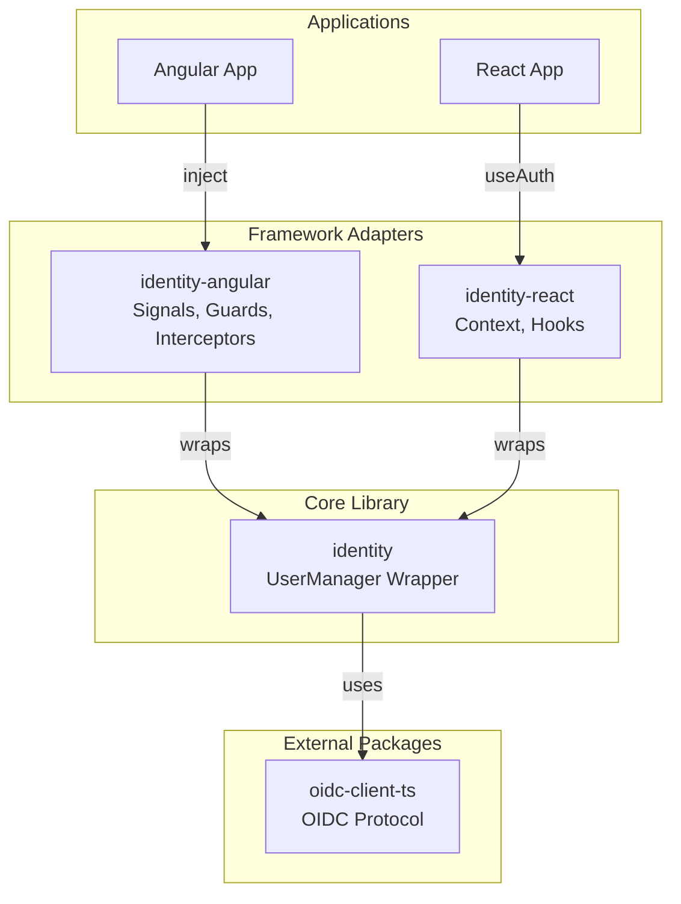
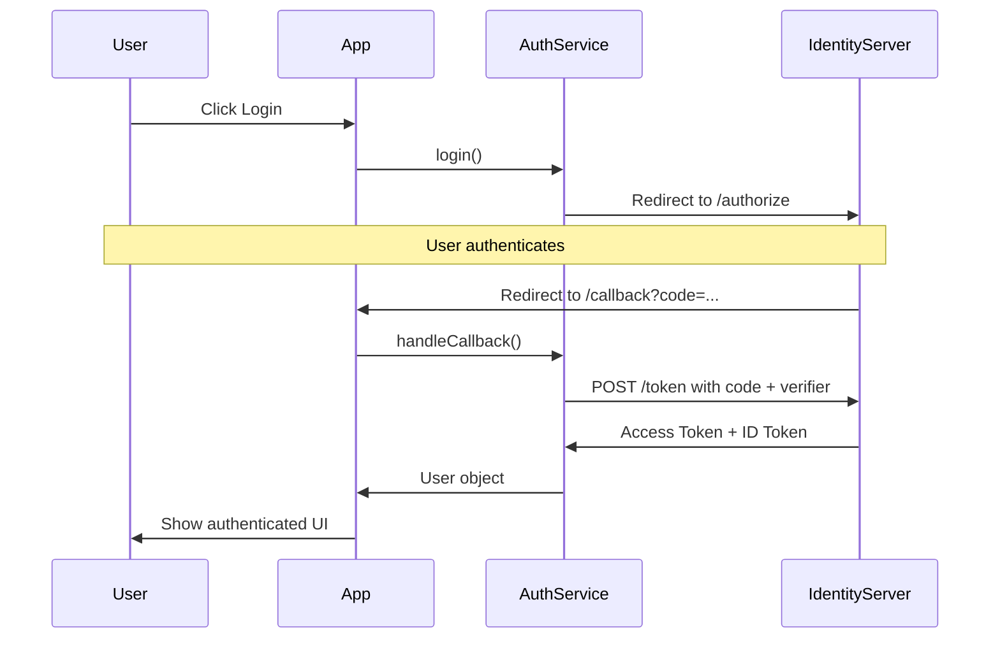

# Identity and Authentication

## Overview

The Omnifex UI monorepo implements OpenID Connect (OIDC) authentication with a framework-agnostic core and framework-specific adapters. This architecture allows both Angular and React applications to share authentication logic while providing idiomatic APIs for each framework.



## Core Library: @omnifex/identity

### Responsibilities

The `@omnifex/identity` core library:

1. **Wraps oidc-client-ts**: Provides a simplified API over the full OIDC client
2. **Manages UserManager**: Singleton instance for authentication state
3. **Handles Token Lifecycle**: Automatic silent refresh, token storage
4. **Framework-Agnostic**: Pure TypeScript with no framework dependencies
5. **Single Source of Truth**: All OIDC logic in one place

### Architecture

```typescript
// libs/identity/src/lib/auth.service.ts
import { UserManager, User, UserManagerSettings } from 'oidc-client-ts';

let userManager: UserManager | null = null;

export function initAuth(config: AuthConfig): void {
  const settings: UserManagerSettings = {
    authority: config.authority,
    client_id: config.clientId,
    redirect_uri: config.redirectUri,
    post_logout_redirect_uri: config.postLogoutRedirectUri,
    response_type: 'code',  // Authorization Code Flow with PKCE
    scope: config.scope,
    automaticSilentRenew: true,
    silent_redirect_uri: `${window.location.origin}/silent-renew.html`,
  };
  
  userManager = new UserManager(settings);
}

export function getAuthService(): AuthService {
  if (!userManager) {
    throw new Error('AuthService not initialized. Call initAuth() first.');
  }
  
  return {
    getUser: () => userManager!.getUser(),
    login: () => userManager!.signinRedirect(),
    logout: () => userManager!.signoutRedirect(),
    handleCallback: () => userManager!.signinRedirectCallback(),
    isAuthenticated: async () => {
      const user = await userManager!.getUser();
      return user !== null && !user.expired;
    }
  };
}

export function resetAuthService(): void {
  userManager = null;
}
```

### Key Design Decisions

**Singleton Pattern**:
- Single `UserManager` instance per application
- Prevents multiple OIDC configurations
- Ensures consistent state across adapters

**Lazy Initialization**:
- `initAuth()` called once at app startup
- `getAuthService()` throws if not initialized
- Clear error messages for misconfiguration

**Testability**:
- `resetAuthService()` clears singleton for testing
- No framework mocks required
- Pure function testing

## OIDC Flow

### Authorization Code Flow with PKCE

The authentication flow follows the OAuth 2.0 Authorization Code Flow with Proof Key for Code Exchange (PKCE):



### Flow Steps

1. **Login Initiation**:
   - User clicks "Login"
   - App calls `authService.login()`
   - Redirects to identity server's `/authorize` endpoint

2. **User Authentication**:
   - User enters credentials at identity server
   - Identity server validates credentials

3. **Authorization Code**:
   - Identity server redirects back to app with `code` parameter
   - App receives redirect at `/callback` route

4. **Token Exchange**:
   - App calls `authService.handleCallback()`
   - Exchanges authorization code for tokens
   - PKCE verifier proves request authenticity

5. **Token Storage**:
   - Tokens stored in session storage (oidc-client-ts default)
   - User object cached in memory

6. **Silent Refresh**:
   - Before token expiry, silent refresh initiated
   - Hidden iframe exchanges refresh token for new access token
   - Seamless for user

### Token Types

**ID Token**:
- JWT containing user identity claims
- `sub`, `name`, `email`, `roles`, etc.
- Used for user profile information

**Access Token**:
- Used for API authorization
- Attached to HTTP requests via `Authorization` header
- Short-lived (typically 1 hour)

**Refresh Token** (optional):
- Long-lived token for obtaining new access tokens
- Enables silent token refresh
- Not exposed to client JavaScript (httpOnly cookie preferred)

## Framework Adapters

### Why Adapters Exist

Each framework has its own patterns for state management, dependency injection, and reactivity:

- **Angular**: Signals, dependency injection, RxJS
- **React**: Hooks, Context API, re-rendering
- **Vue**: Composition API, refs, computed
- **Svelte**: Stores, reactive statements

Adapters bridge the gap between the framework-agnostic core and framework-specific idioms.

### Angular Adapter: @omnifex/identity-angular

#### Architecture

```typescript
// libs/identity-angular/src/lib/auth.service.ts
import { Injectable, signal, effect, DestroyRef, inject } from '@angular/core';
import { getAuthService, type User } from '@omnifex/identity';

@Injectable({ providedIn: 'root' })
export class AuthService {
  private core = getAuthService();
  private destroyRef = inject(DestroyRef);
  
  // Reactive signals
  user = signal<User | null>(null);
  isLoading = signal(true);
  
  // Computed signal
  isAuthenticated = computed(() => this.user() !== null);
  
  constructor() {
    this.initializeAuth();
  }
  
  private async initializeAuth(): Promise<void> {
    try {
      const user = await this.core.getUser();
      this.user.set(user);
    } finally {
      this.isLoading.set(false);
    }
  }
  
  async login(): Promise<void> {
    await this.core.login();
  }
  
  async logout(): Promise<void> {
    await this.core.logout();
  }
  
  async handleCallback(): Promise<void> {
    const user = await this.core.handleCallback();
    this.user.set(user);
  }
}
```

#### Provider Function

```typescript
// libs/identity-angular/src/lib/provide-auth.ts
import { APP_INITIALIZER, Provider } from '@angular/core';
import { initAuth, type AuthConfig } from '@omnifex/identity';
import { AuthService } from './auth.service';

export function provideAuth(config: AuthConfig): Provider[] {
  return [
    {
      provide: APP_INITIALIZER,
      useFactory: () => {
        return () => {
          initAuth(config);
          return Promise.resolve();
        };
      },
      multi: true,
    },
    AuthService,
  ];
}
```

#### Route Guard

```typescript
// libs/identity-angular/src/lib/auth.guard.ts
import { inject } from '@angular/core';
import { Router, type CanActivateFn } from '@angular/router';
import { AuthService } from './auth.service';

export function authGuard(): CanActivateFn {
  return async () => {
    const authService = inject(AuthService);
    const router = inject(Router);
    
    const isAuthenticated = authService.isAuthenticated();
    
    if (!isAuthenticated) {
      await router.navigate(['/']);
      return false;
    }
    
    return true;
  };
}
```

#### HTTP Interceptor

```typescript
// libs/identity-angular/src/lib/auth.interceptor.ts
import { inject } from '@angular/core';
import { HttpInterceptorFn } from '@angular/common/http';
import { AuthService } from './auth.service';

export function authInterceptor(): HttpInterceptorFn {
  return (req, next) => {
    const authService = inject(AuthService);
    const user = authService.user();
    
    if (user?.access_token) {
      req = req.clone({
        setHeaders: {
          Authorization: `Bearer ${user.access_token}`,
        },
      });
    }
    
    return next(req);
  };
}
```

### React Adapter: @omnifex/identity-react

#### Architecture

```typescript
// libs/identity-react/src/useAuth.tsx
import { createContext, useContext, useState, useEffect, ReactNode } from 'react';
import { getAuthService, type User } from '@omnifex/identity';

interface AuthContextValue {
  user: User | null;
  isLoading: boolean;
  isAuthenticated: boolean;
  login: () => Promise<void>;
  logout: () => Promise<void>;
  handleCallback: () => Promise<void>;
}

const AuthContext = createContext<AuthContextValue | null>(null);

export function AuthProvider({ children }: { children: ReactNode }) {
  const [user, setUser] = useState<User | null>(null);
  const [isLoading, setIsLoading] = useState(true);
  const core = getAuthService();
  
  useEffect(() => {
    const initAuth = async () => {
      try {
        const currentUser = await core.getUser();
        setUser(currentUser);
      } finally {
        setIsLoading(false);
      }
    };
    
    initAuth();
  }, []);
  
  const value: AuthContextValue = {
    user,
    isLoading,
    isAuthenticated: user !== null,
    login: async () => {
      await core.login();
    },
    logout: async () => {
      await core.logout();
    },
    handleCallback: async () => {
      const newUser = await core.handleCallback();
      setUser(newUser);
    },
  };
  
  return (
    <AuthContext.Provider value={value}>
      {children}
    </AuthContext.Provider>
  );
}

export function useAuth(): AuthContextValue {
  const context = useContext(AuthContext);
  if (!context) {
    throw new Error('useAuth must be used within AuthProvider');
  }
  return context;
}
```

#### Initialization

```typescript
// apps/react-app/src/index.tsx
import { initAuth } from '@omnifex/identity';
import { AuthProvider } from '@omnifex/identity-react';

// Initialize core before rendering
initAuth({
  authority: 'https://localhost:5001',
  clientId: 'react-app',
  redirectUri: 'http://localhost:3000/callback',
  scope: 'openid profile email roles',
});

root.render(
  <React.StrictMode>
    <AuthProvider>
      <App />
    </AuthProvider>
  </React.StrictMode>
);
```

## Integration Patterns

### Angular Integration

#### 1. Configure Authentication

```typescript
// apps/angular-app/src/app/app.config.ts
import { ApplicationConfig } from '@angular/core';
import { provideRouter } from '@angular/router';
import { provideHttpClient, withInterceptors } from '@angular/common/http';
import { provideAuth, authInterceptor } from '@omnifex/identity-angular';
import { routes } from './app.routes';

export const appConfig: ApplicationConfig = {
  providers: [
    provideRouter(routes),
    provideAuth({
      authority: 'https://localhost:5001',
      clientId: 'angular-app',
      redirectUri: 'http://localhost:4200/callback',
      postLogoutRedirectUri: 'http://localhost:4200',
      scope: 'openid profile email roles',
    }),
    provideHttpClient(
      withInterceptors([authInterceptor()])
    ),
  ],
};
```

#### 2. Use in Components

```typescript
// apps/angular-app/src/app/home/home.ts
import { Component, inject, computed } from '@angular/core';
import { AuthService } from '@omnifex/identity-angular';

@Component({
  selector: 'app-home',
  standalone: true,
  template: `
    <div>
      @if (isAuthenticated()) {
        <p>Welcome, {{ userName() }}!</p>
        <button (click)="logout()">Logout</button>
      } @else {
        <button (click)="login()">Login</button>
      }
    </div>
  `,
})
export class HomeComponent {
  private authService = inject(AuthService);
  
  user = this.authService.user;
  isAuthenticated = this.authService.isAuthenticated;
  userName = computed(() => this.user()?.profile.name ?? 'Guest');
  
  login = () => this.authService.login();
  logout = () => this.authService.logout();
}
```

#### 3. Protect Routes

```typescript
// apps/angular-app/src/app/app.routes.ts
import { Routes } from '@angular/router';
import { authGuard } from '@omnifex/identity-angular';
import { CallbackComponent } from './callback/callback';
import { DashboardComponent } from './dashboard/dashboard';

export const routes: Routes = [
  { path: '', component: HomeComponent },
  { path: 'callback', component: CallbackComponent },
  {
    path: 'dashboard',
    component: DashboardComponent,
    canActivate: [authGuard()],  // Protected route
  },
];
```

#### 4. Handle Callback

```typescript
// apps/angular-app/src/app/callback/callback.ts
import { Component, inject, OnInit } from '@angular/core';
import { Router } from '@angular/router';
import { AuthService } from '@omnifex/identity-angular';

@Component({
  selector: 'app-callback',
  standalone: true,
  template: '<p>Processing authentication...</p>',
})
export class CallbackComponent implements OnInit {
  private authService = inject(AuthService);
  private router = inject(Router);
  
  async ngOnInit() {
    try {
      await this.authService.handleCallback();
      await this.router.navigate(['/dashboard']);
    } catch (error) {
      console.error('Authentication failed:', error);
      await this.router.navigate(['/']);
    }
  }
}
```

### React Integration

#### 1. Initialize and Provide Context

```typescript
// apps/react-app/src/index.tsx
import { initAuth } from '@omnifex/identity';
import { AuthProvider } from '@omnifex/identity-react';
import App from './App';

initAuth({
  authority: 'https://localhost:5001',
  clientId: 'react-app',
  redirectUri: 'http://localhost:3000/callback',
  postLogoutRedirectUri: 'http://localhost:3000',
  scope: 'openid profile email roles',
});

root.render(
  <AuthProvider>
    <App />
  </AuthProvider>
);
```

#### 2. Use in Components

```typescript
// apps/react-app/src/pages/Home.tsx
import { useAuth } from '@omnifex/identity-react';

export function Home() {
  const { user, isAuthenticated, isLoading, login, logout } = useAuth();
  
  if (isLoading) {
    return <div>Loading...</div>;
  }
  
  return (
    <div>
      {isAuthenticated ? (
        <>
          <p>Welcome, {user?.profile.name}!</p>
          <button onClick={logout}>Logout</button>
        </>
      ) : (
        <button onClick={login}>Login</button>
      )}
    </div>
  );
}
```

#### 3. Protect Routes

```typescript
// apps/react-app/src/components/ProtectedRoute.tsx
import { Navigate } from 'react-router-dom';
import { useAuth } from '@omnifex/identity-react';

interface Props {
  children: React.ReactNode;
}

export function ProtectedRoute({ children }: Props) {
  const { isAuthenticated, isLoading } = useAuth();
  
  if (isLoading) {
    return <div>Loading...</div>;
  }
  
  if (!isAuthenticated) {
    return <Navigate to="/" replace />;
  }
  
  return <>{children}</>;
}

// Usage in router
<Route
  path="/dashboard"
  element={
    <ProtectedRoute>
      <Dashboard />
    </ProtectedRoute>
  }
/>
```

#### 4. Handle Callback

```typescript
// apps/react-app/src/pages/Callback.tsx
import { useEffect } from 'react';
import { useNavigate } from 'react-router-dom';
import { useAuth } from '@omnifex/identity-react';

export function Callback() {
  const { handleCallback } = useAuth();
  const navigate = useNavigate();
  
  useEffect(() => {
    const processCallback = async () => {
      try {
        await handleCallback();
        navigate('/dashboard');
      } catch (error) {
        console.error('Authentication failed:', error);
        navigate('/');
      }
    };
    
    processCallback();
  }, []);
  
  return <div>Processing authentication...</div>;
}
```

## Configuration

### OIDC Provider Setup

#### Duende IdentityServer

```csharp
// Config.cs
public static IEnumerable<Client> Clients => new Client[]
{
    new Client
    {
        ClientId = "angular-app",
        ClientName = "Angular Application",
        AllowedGrantTypes = GrantTypes.Code,
        RequirePkce = true,
        RequireClientSecret = false,
        RedirectUris = { "http://localhost:4200/callback" },
        PostLogoutRedirectUris = { "http://localhost:4200" },
        AllowedCorsOrigins = { "http://localhost:4200" },
        AllowedScopes = { "openid", "profile", "email", "roles" }
    }
};
```

#### Azure AD

```typescript
import { azureAuthority } from '@omnifex/identity';

provideAuth({
  authority: azureAuthority('your-tenant-id'),
  clientId: 'your-azure-client-id',
  redirectUri: 'http://localhost:4200/callback',
  scope: 'openid profile email User.Read',
});
```

Azure AD app registration requirements:
1. Platform: Single-page application (SPA)
2. Redirect URIs: `http://localhost:4200/callback`
3. Implicit grant: ID tokens enabled
4. API permissions: User.Read (Microsoft Graph)

### Scopes

Common OIDC scopes:

- `openid`: Required for OIDC
- `profile`: Name, picture, etc.
- `email`: Email address
- `offline_access`: Refresh token
- `roles`: User roles (custom)
- `api`: API access (custom)

### Silent Renew

Create `public/silent-renew.html`:

```html
<!DOCTYPE html>
<html>
<head>
  <script src="https://cdn.jsdelivr.net/npm/oidc-client-ts@3.4.1/dist/browser/oidc-client-ts.min.js"></script>
</head>
<body>
  <script>
    new oidc.UserManager({ response_mode: 'query' }).signinSilentCallback();
  </script>
</body>
</html>
```

## Testing

### Core Library Tests

```typescript
// libs/identity/src/lib/auth.service.spec.ts
import { initAuth, getAuthService, resetAuthService } from './auth.service';

describe('AuthService', () => {
  beforeEach(() => {
    resetAuthService();
  });
  
  it('should throw if not initialized', () => {
    expect(() => getAuthService()).toThrow('AuthService not initialized');
  });
  
  it('should initialize successfully', () => {
    initAuth({
      authority: 'https://example.com',
      clientId: 'test',
      redirectUri: 'http://localhost:4200/callback',
      scope: 'openid',
    });
    
    expect(() => getAuthService()).not.toThrow();
  });
});
```

### Angular Adapter Tests

```typescript
// libs/identity-angular/src/lib/auth.service.spec.ts
import { TestBed } from '@angular/core/testing';
import { AuthService } from './auth.service';

describe('AuthService', () => {
  let service: AuthService;
  
  beforeEach(() => {
    TestBed.configureTestingModule({
      providers: [AuthService],
    });
    service = TestBed.inject(AuthService);
  });
  
  it('should initialize with null user', () => {
    expect(service.user()).toBeNull();
  });
});
```

### React Adapter Tests

```typescript
// libs/identity-react/src/useAuth.spec.tsx
import { renderHook } from '@testing-library/react';
import { AuthProvider, useAuth } from './useAuth';

describe('useAuth', () => {
  it('should provide auth context', () => {
    const wrapper = ({ children }) => <AuthProvider>{children}</AuthProvider>;
    const { result } = renderHook(() => useAuth(), { wrapper });
    
    expect(result.current.isAuthenticated).toBe(false);
  });
});
```

## Next Steps

- **Styles**: Learn about theming in [styles-and-design-system.md](./styles-and-design-system.md)
- **Testing**: Understand test strategies in [testing-strategy.md](./testing-strategy.md)
- **Troubleshooting**: Common auth issues in [troubleshooting.md](./troubleshooting.md)

