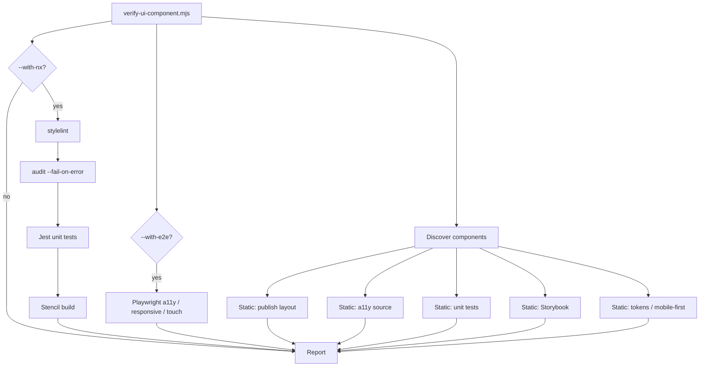

# UI Component Verification

**Status:** Active · **Scope:** `@omnifex/ui-components` (Stencil web components)  
**Entry script:** `tools/scripts/verify-ui-component.mjs`  
**Related:** [figma-integration.md](./figma-integration.md), [ui-components-qa.md](./ui-components-qa.md), [../ai-context/prompts/](../ai-context/prompts/), [../../.cursor/rules.md](../../.cursor/rules.md)

---

## Overview

The verification system ensures shared UI components are:

- **Responsive** and **mobile-first**
- **Accessible** (semantic HTML, focus, axe in e2e)
- **Token-driven** (no hex/raw px in component CSS)
- **Tested** (unit specs + optional Playwright gates)
- **Storybook-documented** (variants, responsive stories, a11y addon)
- **Publishable** (dual ESM/CJS, loader, dist layout)
- **Cross-platform** (Node.js only — Windows, macOS, Linux)

It composes **static analysis** (fast, dependency-free CSS/source checks) with **Nx orchestration** (stylelint, audit, Jest, Stencil build, optional e2e).

### Publishable vs legacy components

| Tier | Components | Missing Storybook/tests |
|------|------------|-------------------------|
| **Publishable** (full DoD) | `button` (extend in `PUBLISHABLE_COMPONENTS` in `tools/scripts/ui-component-verify/constants.mjs`) | **Error** |
| **Legacy** | `badge`, `card`, `header`, etc. | **Warning** |

Token/CSS violations are **errors for all components**.

---

## Verification workflow



1. **Discover** folders under `libs/ui-components/src/lib/<component>/` with `<component>.tsx`.
2. **Static checks** — no install beyond repo checkout.
3. **Nx gates** (default for `verify` target) — requires `pnpm install` and prior builds for publish checks.
4. **E2e** (optional) — Playwright against Angular app shell.

---

## Validation rules

### Accessibility

| Check | How enforced | Blocking |
|-------|----------------|----------|
| Semantic controls | Source scan (`<button>`, no `<div onClick>`) | Error |
| Focus visibility | CSS scan (no hover-only affordances) + stylelint | Error |
| `aria-hidden` on decorative icons | Source heuristic | Warning |
| axe WCAG 2.2 AA | `nx run angular-app-e2e:e2e:a11y` (`--with-e2e`) | Error when e2e run |
| Keyboard / ARIA completeness | Manual + Storybook a11y addon | Review |

### Responsive / mobile-first

| Check | How enforced | Blocking |
|-------|----------------|----------|
| No `@media (max-width:)` only | CSS scan + stylelint | Error |
| Viewports 360 / 768 / 1280 | `e2e:responsive` (`--with-e2e`) | Error when e2e run |
| No horizontal overflow | Playwright scrollWidth ≤ clientWidth | Error when e2e run |
| Touch targets ≥ 44×44 CSS px | `e2e:touch` (`--with-e2e`) | Error when e2e run |
| `full-width` / flex layouts | Storybook + implementation review | Warning |

### Design system / tokens

| Check | How enforced | Blocking |
|-------|----------------|----------|
| No hex in component CSS | CSS scan + stylelint | Error |
| No raw `rgb()` / `hsl()` | CSS scan | Error |
| No hardcoded `NNpx` (publishable) | CSS scan | Error |
| `var(--*)` on token properties | CSS scan + stylelint `tokens-only` | Warning / Error |
| rem via tokens (16px root) | Documented in [figma-integration.md](./figma-integration.md) | — |

Primitives (`#hex`) belong only in `libs/styles/src/lib/*.css`.

### Storybook

| Check | How enforced | Blocking |
|-------|----------------|----------|
| `.storybook/main.ts` with `addon-a11y` | Static read | Error |
| `<component>.stories.ts` exists | File check | Error (publishable) |
| ≥ 2 exported stories | Regex | Error (publishable) |
| Responsive story (layout/matrix) | Source pattern | Error (publishable) |
| Light/dark in `preview.ts` | Source pattern | Warning |

### Testing

| Check | How enforced | Blocking |
|-------|----------------|----------|
| `*.spec.tsx` exists | File check | Error (publishable) |
| Jest/Stencil unit tests | `nx run @omnifex/ui-components:test` | Error (`--with-nx`) |
| Responsive / touch / axe | Playwright e2e (`--with-e2e`) | Error when run |
| Visual regression | `test-storybook:visual` (Phase 2) | Info until configured |

### Publishability

| Check | How enforced | Blocking |
|-------|----------------|----------|
| `package.json` `exports` ESM + CJS | JSON read | Error |
| `./loader` export | JSON read | Warning |
| `dist/ui-components` layout after build | `stat` on paths | Error (`--with-nx`) |
| Stencil build | `nx run @omnifex/ui-components:build` | Error (`--with-nx`) |

---

## Commands

### Development & quality targets (`@omnifex/ui-components`)

Run from the repository root with `corepack pnpm`:

```bash
# Compile Stencil components and copy publishable output to dist/ui-components
corepack pnpm nx run @omnifex/ui-components:build

# Unit tests (Jest + @stencil/core/testing)
corepack pnpm nx run @omnifex/ui-components:test

# Token / mobile-first / hex rules on component CSS
corepack pnpm nx run @omnifex/ui-components:stylelint

# Storybook 8 (requires build first; http://localhost:6006)
corepack pnpm nx run @omnifex/ui-components:storybook
```

| Target | Purpose |
|--------|---------|
| `build` | Stencil production build + `publish-ui-components.mjs` → `dist/ui-components` |
| `test` | `libs/ui-components/**/*.spec.tsx` via Jest |
| `stylelint` | `omnifex/*` plugin rules on `libs/ui-components/**/*.css` |
| `storybook` | Interactive docs for web components (`dependsOn: build`) |

Related targets:

```bash
corepack pnpm nx run @omnifex/ui-components:audit
corepack pnpm nx run @omnifex/ui-components:build-storybook
```

### Verification (all-in-one)

```bash
# Default: static checks (all components) + stylelint + audit + test + build
# Publishable tier (button) is strictly enforced; legacy components report warnings.
corepack pnpm nx run @omnifex/ui-components:verify

# Static only (CI fast path / no install heavy steps)
corepack pnpm nx run @omnifex/ui-components:verify:static

# Full gate including Playwright (slow; needs browsers + app e2e setup)
corepack pnpm nx run @omnifex/ui-components:verify:full

# Single publishable component
corepack pnpm nx run @omnifex/ui-components:verify:button
```

Pass extra CLI flags after `--`:

```bash
corepack pnpm nx run @omnifex/ui-components:verify -- --component=button --fail-fast
```

### Direct Node (cross-platform)

```bash
node tools/scripts/verify-ui-component.mjs --help
node tools/scripts/verify-ui-component.mjs --static --fail-on-error
node tools/scripts/verify-ui-component.mjs --component=button --with-nx --fail-on-error
node tools/scripts/verify-ui-component.mjs --with-nx --with-e2e --fail-on-error
```

### App e2e gates (Playwright)

```bash
corepack pnpm nx run angular-app-e2e:e2e:a11y
corepack pnpm nx run angular-app-e2e:e2e:responsive
corepack pnpm nx run angular-app-e2e:e2e:touch
```

---

## CI integration

Recommended pipeline stages:

| Stage | Command | When |
|-------|---------|------|
| Fast PR | `nx run @omnifex/ui-components:verify:static` | Every PR touching `libs/ui-components` or `libs/styles` |
| Standard PR | `nx run @omnifex/ui-components:verify` | Merge queue / main |
| Nightly / pre-release | `nx run @omnifex/ui-components:verify:full` | Before publish |

`verify` uses `node tools/scripts/verify-ui-component.mjs` (no bash). Nx subprocesses use `node node_modules/nx/bin/nx.js` for portability.

---

## Definition of Done

A **publishable** component (e.g. `andy-ui-button`) is done when:

- [ ] `nx run @omnifex/ui-components:verify --configuration=button` passes (or `--component=button`)
- [ ] Storybook stories cover variants, sizes, states, light/dark
- [ ] Unit spec covers render, props, disabled, events
- [ ] No hex / max-width-only / hover-only in its CSS
- [ ] Figma/token mapping documented in component `readme.md`
- [ ] Consumed in Angular + React without forking styles
- [ ] E2e gates pass when UI is reachable on `/callback` or dashboard routes

Add the component id to `PUBLISHABLE_COMPONENTS` in `tools/scripts/ui-component-verify/constants.mjs` when promoting from legacy to publishable.

---

## Anti-patterns

| Anti-pattern | Result |
|--------------|--------|
| Skipping `verify` after CSS changes | Regressions in tokens or mobile-first |
| Hardcoding `#1731ab` in `button.css` | verify + stylelint failure |
| Desktop-only Storybook viewport | Misses overflow/touch issues |
| `div` click handlers in Stencil | Static a11y error |
| Running only unit tests, no stylelint | Misses hover-only / hex |
| Assuming Figma MCP CSS is valid | Violates [figma-integration.md](./figma-integration.md) |

---

## Troubleshooting

### `verify` fails on missing Storybook for `card`

Expected for legacy components (warning). For publishable tier, add `<component>.stories.ts` or remove from legacy-only workflow.

### `verify` fails publish artifacts

Run build first:

```bash
corepack pnpm nx run @omnifex/ui-components:build
corepack pnpm nx run @omnifex/ui-components:verify -- --skip-build
# or full verify after build
corepack pnpm nx run @omnifex/ui-components:verify
```

### Nx subprocess not found on Windows

The runner uses `node path/to/nx/bin/nx.js` — ensure `pnpm install` at repo root. Do not rely on global `nx` CLI.

### E2e fails: identity server / redirect

Playwright specs target `/callback` and shell components. Ensure `angular-app:serve-e2e` configuration matches `angular-app-e2e` docs. Use `--static` locally if e2e env is unavailable.

### False positive `px` in component CSS

Stroke widths must use `var(--stroke-*)`. If a value is truly required, add a semantic token in `libs/styles` and reference it.

### Extending the system

| Task | Location |
|------|----------|
| Add publishable component | `tools/scripts/ui-component-verify/constants.mjs` → `PUBLISHABLE_COMPONENTS` |
| New static rule | `tools/scripts/ui-component-verify/checks/*.mjs` |
| New Nx gate | `checks/nx-runner.mjs` + `project.json` target |

---

## Module layout

```
tools/scripts/verify-ui-component.mjs          # CLI entry
tools/scripts/ui-component-verify/
  constants.mjs                                 # paths, publishable set
  discover.mjs                                  # component discovery
  css-scan.mjs                                # token/mobile-first scanner
  report.mjs                                    # findings + console output
  checks/
    tokens.mjs
    storybook.mjs
    tests.mjs
    accessibility-static.mjs
    publish.mjs
    nx-runner.mjs
```

---

*Aligns with Andy UI Design System governance in [figma-integration.md](./figma-integration.md).*
