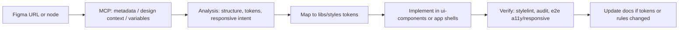

# Figma MCP Integration Standard

**Status:** Active · **Audience:** AI agents (Cursor), frontend engineers, design-system owners  
**Repository:** Andy UI Nx monorepo (`angular-app`, `react-app`, `@omnifex/styles`, `@omnifex/ui-components`)  
**Figma file:** [Andy UI — Design System](https://www.figma.com/design/TcEuJHlNPkME9br19X1Qhx/Andy-UI---Design-System) (`fileKey`: `TcEuJHlNPkME9br19X1Qhx`)

Related docs:

- [`styles-and-design-system.md`](./styles-and-design-system.md) — theme architecture and usage
- [`ui-components-qa.md`](./ui-components-qa.md) — lint, audit, Playwright gates
- [`/docs/ai-context/overview.md`](../ai-context/overview.md) — monorepo constraints
- [`/docs/ai-context/prompts/`](../ai-context/prompts/) — Cursor Auto prompt templates
- Token source: `libs/styles/src/lib/` (`theme.css`, `typography.css`, `spacing.css`, `radius.css`, `stroke.css`)

---

## 1. Overview

### Purpose

Figma MCP connects Cursor to the Andy UI Figma file so AI-assisted and human development share one visual source of truth. The integration exists to:

- Translate **design intent** into **token-driven, framework-agnostic** code
- Keep Angular, React, and Stencil components visually aligned
- Reduce drift between Figma variables and `libs/styles` CSS custom properties
- Improve AI-generated UI quality with structured analysis before coding

### Expected workflow



1. Developer or AI receives a **node-specific** Figma URL (with `node-id`).
2. AI calls Figma MCP tools (**analysis first**, implementation second).
3. Values are mapped to existing CSS variables; missing scales are added in `libs/styles`, not in components.
4. UI is built **mobile-first**, accessible, and shared across frameworks where possible.
5. Quality gates run before merge; documentation is updated when governance changes.

### Responsibilities

| Role | Responsibility |
|------|----------------|
| **Design-system owner** | Keeps Figma variables and token frames aligned; documents node IDs for scales |
| **Developer** | Supplies correct Figma URLs; reviews AI output; runs verification commands |
| **AI agent** | Reads this doc + `styles-and-design-system.md`; never pastes raw Figma CSS; maps to tokens; flags doc/token gaps |
| **Reviewer** | Confirms Definition of Done (§9) before approving UI PRs |

---

## 2. Figma-to-Code Principles

These rules are **mandatory** for all Figma-driven work.

- **Do NOT blindly copy Figma-generated CSS.** MCP `get_design_context` output is reference material, not drop-in code.
- **Treat Figma as design intent, not implementation.** Layouts in Figma are often fixed-width artboards; code must be fluid and responsive.
- **Convert all spacing and sizing to design tokens.** Use `var(--space-*)`, `var(--font-*)`, `var(--radius-*)`, `var(--stroke-*)`, `var(--theme-*)`.
- **Always interpret layouts responsively.** Start at the smallest supported viewport (360px width in e2e); enhance with `min-width` media queries.
- **Preserve accessibility.** Semantic HTML, focus states, contrast, labels, and touch targets are non-negotiable.
- **Prefer shared implementation.** New UI belongs in `@omnifex/ui-components` (Stencil) when used by more than one app.
- **Use rem in token definitions.** Root font size is **16px** (`1rem = 16px`). Convert Figma px → rem: `rem = px / 16`.
- **Hex only in token primitives.** Component CSS must not contain `#` colors (enforced by `omnifex/no-hex-in-components`).

---

## 3. Design Token Mapping Rules

### px → rem conversion

| Figma (px) | CSS token value (rem) | Notes |
|------------|------------------------|--------|
| 2 | `0.125rem` | `--space-0` |
| 4 | `0.25rem` | `--space-1` |
| 8 | `0.5rem` | `--space-2` |
| 16 | `1rem` | `--space-4`, default body |
| 24 | `1.5rem` | `--space-6` |
| 32 | `2rem` | `--space-7` |
| *n* | `n / 16` rem | Round to sensible precision (3–4 decimals max) |

**Snap rule:** If Figma px is within **2px** of a scale step, use the token. If not, add a token to `libs/styles` or escalate to design-system owner—do not hardcode in a component.

### Typography scale

**Source frame:** Figma node `1:8246` (Typography).  
**Font:** Ubuntu — 400 Regular, 500 Medium, 700 Bold.  
**File:** `libs/styles/src/lib/typography.css`

| Figma style | Size (px) | Token primitives | Semantic alias |
|-------------|-----------|------------------|----------------|
| H-1 … H-7 | 68 → 22 | `--font-h1-size` … `--font-h7-size` | `--text-display-*`, `--text-title-*` |
| B-1 | 18 (medium) | `--font-b1-size` | `--text-subtitle-*` |
| B-2 | 16 (regular) | `--font-b2-size` | `--text-body-*` (default body) |
| B-3 … B-7 | 14 → 6 | `--font-b3-size` … `--font-b7-size` | `--text-label-*`, `--text-caption-*` |

- Always set **size, line-height, and weight** from tokens (e.g. `var(--font-h5-size)`, `var(--font-h5-line-height)`, `var(--font-h5-weight)`).
- Legacy aliases `--font-size-xs` … `--font-size-2xl` map to the new scale; prefer `--font-b*` / `--font-h*` in new code.
- Tailwind: `text-h4`, `text-b2`, `font-sans` (see `tailwind.config.ts`).

### Spacing scale

**Source frame:** Figma node `1:8356`.  
**File:** `libs/styles/src/lib/spacing.css`

| Token | px | Use |
|-------|-----|-----|
| `--space-0` … `--space-10` | 2 → 56 | Padding, gap, margin |
| `--space-gap-*` | — | Flex/grid gaps |
| `--space-padding-*` | — | Component internal padding |
| `--space-page-inline` / `--space-page-block` | — | Page shells |

### Radius scale

**Source frame:** Figma node `1:8750`.  
**File:** `libs/styles/src/lib/radius.css`

| Token | px | Semantic |
|-------|-----|----------|
| `--radius-none` | 0 | — |
| `--radius-1` … `--radius-8` | 4 → 24 | — |
| `--radius-full` | 999 | Pills, avatars |
| `--radius-button`, `--radius-card`, etc. | — | Prefer semantic aliases in components |

### Stroke (border width)

**Source frame:** Figma node `1:8917`.  
**File:** `libs/styles/src/lib/stroke.css`

| Token | px |
|-------|-----|
| `--stroke-0` … `--stroke-4` | 1 → 8 |
| `--stroke-border`, `--stroke-focus`, `--stroke-emphasis` | Semantic |

Pair stroke width tokens with **theme border colors**: `var(--theme-border-primary)`, not raw hex.

### Elevation / shadow

- Andy UI Figma may specify shadows per component; there is **no global shadow scale** in `libs/styles` yet.
- **Rule:** Do not invent arbitrary `box-shadow` values in components.
- If a shadow is required:
  1. Check whether an existing component pattern already defines it.
  2. If repeated, add primitives to `theme.css` (e.g. `--shadow-elevation-1`) sourced from Figma.
  3. Reference only via `var(--shadow-*)`.
- Prefer surface hierarchy (`--theme-surface-elevated`) and borders over heavy shadows when possible.

### Color token usage

**Source frame:** Figma node `1:7336` (Colors).  
**File:** `libs/styles/src/lib/theme.css`

| Layer | Pattern | Example |
|-------|---------|---------|
| Primitives | `--color-primary-*`, `--color-neutral-*` | Defined once in `theme.css` |
| Semantic (theme) | `--theme-bg-*`, `--theme-text-*`, `--theme-accent-*` | **Use in all components** |
| App overrides | `theme-secondary.css` (React) | Remap accents only; do not fork primitives |

- **Prohibit hex in component CSS** (`libs/ui-components/**/*.css`, app component CSS subject to audit).
- Light/dark: use `[data-theme='dark']` semantic tokens; do not duplicate palettes per component.
- Status colors: `var(--theme-status-success)`, etc.

### Figma node ID reference (Design System)

| Scale | Frame node ID | URL `node-id` note |
|-------|---------------|---------------------|
| Colors | `1:7336` | Child gradient nodes are not token sources |
| Typography | `1:8246` | e.g. `1-7329` may point at a gradient child only |
| Spacing | `1:8356` | |
| Radius | `1:8750` | |
| Stroke | `1:8917` | |
| Design System page | `1:1101` | Use `get_metadata` to discover children |

**Critical:** If `get_variable_defs` returns empty on a child swatch, call `get_metadata` on the parent frame and re-fetch variables from the **scale frame**, not decorative gradient layers.

---

## 4. Responsive & Mobile-First Rules

### Mandatory rules

- **Mobile-first implementation:** Base styles target the smallest layout; use `@media (min-width: …)` to enhance. **`max-width`-only queries are forbidden** in component CSS (`omnifex/mobile-first-media`).
- **Responsive layouts by default:** Use flexbox and CSS grid; avoid fixed page widths.
- **Touch-friendly interactions:** Tap targets, adequate spacing, no hover-only critical actions (`omnifex/no-hover-only-affordance`).
- **Minimum 44×44 CSS px hit targets** for primary interactive controls on mobile (enforced in e2e `@touch`).
- **Avoid fixed widths/heights** except icons, avatars, and deliberate constraints (use `max-width: 100%`, `min-height`, `clamp()` when needed).
- **Prefer flex/grid** over absolute positioning; absolute layout only for badges, overlays, or proven decorative cases.

### Breakpoint strategy

Align with existing app patterns and e2e viewports:

| Name | min-width | Typical use |
|------|-----------|-------------|
| (base) | 0 | Mobile default — design at **360px** width minimum |
| `sm` | 640px | Compact layout adjustments |
| `md` | 768px | Tablet — e.g. two-column grids |
| `lg` | 1024px | Desktop — e.g. three-column grids |
| `xl` | 1280px | Max content width / page shells |

Example (mobile-first grid):

```css
.cards {
  display: grid;
  grid-template-columns: 1fr;
  gap: var(--space-gap-md);
}

@media (min-width: 768px) {
  .cards {
    grid-template-columns: repeat(2, 1fr);
  }
}

@media (min-width: 1024px) {
  .cards {
    grid-template-columns: repeat(3, 1fr);
  }
}
```

### Interpreting Figma frames

- Figma desktop artboard width (e.g. 1440px) is **not** the default CSS width.
- Auto-layout in Figma maps to **flex/grid + gap tokens**, not fixed pixel widths.
- When Figma shows multiple device frames, implement **one component** with responsive rules, not separate duplicate components per breakpoint.

---

## 5. Accessibility Rules

Requirements apply to all Figma-derived UI.

| Area | Requirement |
|------|-------------|
| **Keyboard** | All interactive elements reachable via Tab; logical focus order |
| **Focus visibility** | `:focus-visible` with `var(--stroke-focus)` and theme accent (see app `styles.scss` / `index.css`) |
| **Screen readers** | Semantic elements (`button`, `nav`, `main`, `label`, `h1`–`h6`); `aria-*` only when HTML is insufficient |
| **Color contrast** | Meet WCAG 2.2 AA for text and controls; use semantic theme tokens, not low-contrast custom pairs |
| **Touch targets** | ≥ 44×44 CSS px on mobile for primary actions |
| **Motion** | Respect `prefers-reduced-motion` when adding animations |
| **Forms** | Visible labels, associated inputs, error text linked with `aria-describedby` |

Verification:

```bash
corepack pnpm nx run angular-app-e2e:e2e:a11y
corepack pnpm nx run react-app-e2e:e2e:a11y
corepack pnpm nx run angular-app-e2e:e2e:touch
```

---

## 6. Figma MCP Usage Workflow

### Prerequisites

- Figma MCP server enabled in Cursor (`user-Figma`).
- User authenticated to Figma (`whoami` / `mcp_auth` if calls fail).
- Figma desktop app or appropriate access for the design file.

### Tool selection (in order)

| Step | Tool | When to use |
|------|------|-------------|
| 1 | `get_metadata` | Discover page structure and **parent frame IDs** when URL points at a child or swatch |
| 2 | `get_variable_defs` | Read Figma variables on the **correct scale frame** |
| 3 | `get_design_context` | Primary tool: screenshot + structure + reference code for a component |
| 4 | `get_screenshot` | Optional extra visual when context is large |
| 5 | Code Connect tools | Only when explicitly wiring Figma ↔ repo components |

**Prefer `get_design_context` for components.** Use `get_metadata` first when the linked node is a gradient, icon-only leaf, or unknown structure.

### URL format for developers

Always share links in this form:

```text
https://www.figma.com/design/TcEuJHlNPkME9br19X1Qhx/Andy-UI---Design-System?node-id=1-8356&m=dev
```

Rules:

- Must include `node-id` (convert `1-8356` → `1:8356` for MCP `nodeId`).
- `fileKey` = `TcEuJHlNPkME9br19X1Qhx`.
- For branch URLs, use `branchKey` as `fileKey` per MCP schema.
- FigJam (`/board/`) and Make (`/make/`) files are not supported by standard design tools.

### Analysis-first workflow (AI)

Before writing code:

1. Read [`figma-integration.md`](./figma-integration.md) and [`styles-and-design-system.md`](./styles-and-design-system.md).
2. Fetch Figma context (metadata → variables → design context).
3. Produce a short **implementation plan**: tokens used, responsive behavior, shared vs app-specific location, a11y notes.
4. Confirm token existence in `libs/styles`; extend tokens if scale is missing.
5. Implement minimal diff; run stylelint / audit / targeted e2e.
6. Update docs if tokens or rules changed (§10).

### Nx monorepo placement

| Change type | Location |
|-------------|----------|
| New design token | `libs/styles/src/lib/*.css` + import via `theme.css` |
| Shared component | `libs/ui-components/src/lib/<name>/` |
| Angular-only shell | `apps/angular-app/` |
| React-only shell | `apps/react-app/` |
| Tailwind mapping | `tailwind.config.ts` |

---

## 7. AI Prompting Standards

Use the **canonical prompt templates** in [`docs/ai-context/prompts/`](../ai-context/prompts/). They enforce this standard, MCP workflow, and [component-verification.md](./component-verification.md).

| Step | Prompt file |
|------|-------------|
| Analyze (no code) | [`figma-analysis.md`](../ai-context/prompts/figma-analysis.md) |
| Implement | [`figma-component-implementation.md`](../ai-context/prompts/figma-component-implementation.md) |
| Audit / pre-PR | [`figma-component-audit.md`](../ai-context/prompts/figma-component-audit.md) |
| Storybook | [`figma-storybook.md`](../ai-context/prompts/figma-storybook.md) |
| Tests | [`figma-tests.md`](../ai-context/prompts/figma-tests.md) |

**Cursor invocation:**

```text
Follow docs/ai-context/prompts/figma-analysis.md
Figma URL: https://www.figma.com/design/TcEuJHlNPkME9br19X1Qhx/Andy-UI---Design-System?node-id=14-4&m=dev
Component: button
```

See [`prompts/README.md`](../ai-context/prompts/README.md) for the recommended Auto workflow and best practices.

---

## 8. Anti-Patterns to Avoid

| Anti-pattern | Why it fails | Correct approach |
|--------------|--------------|------------------|
| Hardcoded `16px`, `#3857e4`, `border-radius: 8px` in components | Breaks token contract; fails stylelint | `var(--space-4)`, `var(--theme-accent-primary)`, `var(--radius-3)` |
| Pasting Figma MCP CSS into apps | Desktop-fixed, non-semantic, not cross-framework | Rebuild with tokens + semantic HTML |
| Desktop-first `@media (max-width: …)` only | Violates mobile-first rule | Base mobile + `min-width` enhancements |
| Absolute positioning for main layout | Breaks responsive reflow | Flex/grid + gap tokens |
| Ignoring empty variables on gradient child nodes | Wrong or missing tokens | `get_metadata` → parent frame ID |
| Hover-only buttons/links | Keyboard users blocked | Mirror styles on `:focus-visible` |
| New hex in `ui-components` CSS | `omnifex/no-hex-in-components` | Theme primitives only in `theme.css` |
| Duplicate components per breakpoint | Unmaintainable | One component, responsive CSS |
| Inter or ad-hoc font stacks | Off-brand | `var(--font-family-sans)` (Ubuntu) |
| Skipping e2e after visual change | Regressions slip through | Run `e2e:a11y`, `e2e:responsive`, `e2e:touch` |

---

## 9. Definition of Done

A Figma-derived component or feature is **complete** only when all are true:

- [ ] **Responsive** — Works at 360, 768, and 1280px without horizontal scroll (`e2e:responsive`)
- [ ] **Mobile-first** — No forbidden `max-width`-only media queries in component CSS
- [ ] **Accessible** — Semantic HTML, focus visible, axe serious/critical = 0 (`e2e:a11y`)
- [ ] **Token-driven** — Colors, spacing, type, radius, stroke, z-index use `var(--*)`; no hex in components
- [ ] **Tested** — Unit/e2e as appropriate; touch targets on mobile (`e2e:touch`)
- [ ] **Cross-framework compatible** — Shared UI in Stencil when used by both apps; theme via `theme.css`
- [ ] **Stylelint clean** — `corepack pnpm nx run @omnifex/ui-components:stylelint` (when CSS touched)
- [ ] **Documented** — Token or rule changes reflected per §10

---

## 10. Documentation Synchronization Rules

Update documentation when changes affect governance or discovery:

| Trigger | Update |
|---------|--------|
| Figma scale added/changed | `libs/styles/src/lib/*.css` comments (Figma node ID), `libs/styles/README.md`, §3 tables in this file if IDs change |
| New token category | `theme.css` + this doc §3 + `styles-and-design-system.md` |
| New shared component | Component readme / Storybook (Phase 2), `ui-components-qa.md` if gates change |
| New responsive rule | This doc §4 + `.stylelintrc` / stylelint plugin if enforced |
| Accessibility rule change | This doc §5 + `ui-components-qa.md` |
| MCP workflow change | This doc §6–7 |

AI agents must update docs in the **same PR** as token or rule changes, not as follow-up.

---

## 11. Example Figma-to-Component Flow

**Scenario:** Implement a marketing **Card** used in Angular and React dashboards.

### Step 1 — Figma component analysis

**URL:** `https://www.figma.com/design/TcEuJHlNPkME9br19X1Qhx/Andy-UI---Design-System?node-id=<card-node>&m=dev`

AI actions:

1. `get_metadata` — confirm component name, children (title, body, actions), padding.
2. `get_design_context` — screenshot + reference layout (do not paste CSS).
3. `get_variable_defs` — on the card or parent frame for fills and text styles.

Extracted intent (example):

- Surface: elevated panel on secondary background
- Padding: 24px → `--space-6`
- Radius: 12px → `--radius-card` (`--radius-5`)
- Border: 1px neutral → `--stroke-border` + `--theme-border-primary`
- Title: 18px medium → `--font-b1-*`
- Body: 16px regular → `--font-b2-*`
- Gap between title and body: 12px → `--space-3`

### Step 2 — Token mapping

| Figma | CSS |
|-------|-----|
| Fill surface | `background-color: var(--theme-surface-primary)` |
| Title 18/27 Medium | `font-size: var(--font-b1-size); line-height: var(--font-b1-line-height); font-weight: var(--font-b1-weight)` |
| Body 16/24 | `var(--font-b2-size)`, `var(--font-b2-line-height)` |
| Padding 24 | `padding: var(--space-6)` |
| Radius 12 | `border-radius: var(--radius-card)` |

No `#` values in `card.css`.

### Step 3 — Responsive interpretation

- Mobile: single column, full width, `padding: var(--space-padding-sm)` if frame is tighter.
- `min-width: 768px`: optional side-by-side actions with `gap: var(--space-gap-md)`.
- Card never uses fixed `width: 400px`; use `max-width: 100%` inside grids.

### Step 4 — Implementation strategy

| Layer | Action |
|-------|--------|
| `@omnifex/ui-components` | Extend existing `card` Stencil component if markup matches |
| Apps | Consume `<omnifex-card>`; app CSS only for page grid (`Dashboard.css`) |
| Tailwind | Use `p-6`, `rounded-5`, `text-b1` only if aligned with `tailwind.config.ts` maps |

Verification:

```bash
corepack pnpm nx run @omnifex/ui-components:stylelint
corepack pnpm nx run @omnifex/ui-components:audit
corepack pnpm nx run angular-app-e2e:e2e:a11y
corepack pnpm nx run angular-app-e2e:e2e:responsive
```

### Step 5 — Testing strategy

- **Visual:** Compare Storybook or running app against Figma screenshot (light + dark).
- **Responsive:** Playwright at 360 / 768 / 1280.
- **A11y:** axe on pages using the card; heading order for titles.
- **Touch:** If card contains buttons, assert 44×44 min on mobile viewport.

---

## Quick reference — verification commands

```bash
# @omnifex/ui-components — development
corepack pnpm nx run @omnifex/ui-components:build
corepack pnpm nx run @omnifex/ui-components:test
corepack pnpm nx run @omnifex/ui-components:stylelint
corepack pnpm nx run @omnifex/ui-components:storybook

# All-in-one component verification
corepack pnpm nx run @omnifex/ui-components:verify

# Dependency-free token audit
corepack pnpm nx run @omnifex/ui-components:audit

# Build shared styles
corepack pnpm nx run @omnifex/styles:build

# E2E quality gates
corepack pnpm nx run angular-app-e2e:e2e:a11y
corepack pnpm nx run angular-app-e2e:e2e:responsive
corepack pnpm nx run angular-app-e2e:e2e:touch
```

See [component-verification.md](./component-verification.md) for the full workflow.

---

*This document is the authoritative standard for Figma MCP ↔ Andy UI implementation. When in doubt, prefer tokens, mobile-first layout, and analysis before code.*
