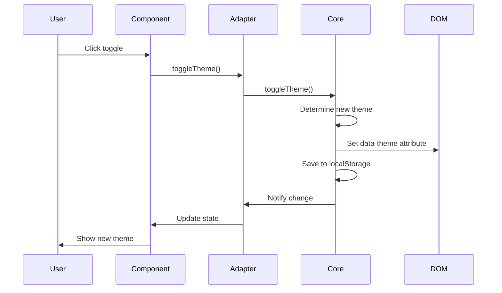

# Styles and Design System

## Overview

The Omnifex UI design system consists of three complementary parts:

1. **@omnifex/styles**: Framework-agnostic theme management with CSS custom properties
2. **Framework Adapters**: Angular and React wrappers for theme control
3. **@omnifex/ui-components**: Stencil web components for shared UI elements

This architecture enables consistent theming across Angular and React applications while maintaining framework-specific developer experiences.

```mermaid
graph TB
    subgraph Apps [Applications]
        AngularApp[Angular App<br/>Tailwind + SCSS]
        ReactApp[React App<br/>Tailwind + CSS]
    end
    
    subgraph Adapters [Framework Adapters]
        StylesAngular[@omnifex/styles-angular<br/>ThemeService Signal]
        StylesReact[@omnifex/styles-react<br/>ThemeProvider Hook]
    end
    
    subgraph Core [Core Library]
        StylesCore[@omnifex/styles<br/>ThemeService]
        ThemeCSS[theme.css<br/>CSS Custom Properties]
    end
    
    subgraph Components [Web Components]
        UIComponents[@omnifex/ui-components<br/>Stencil Components]
    end
    
    AngularApp -->|uses| StylesAngular
    AngularApp -->|imports| ThemeCSS
    AngularApp -->|renders| UIComponents
    
    ReactApp -->|uses| StylesReact
    ReactApp -->|imports| ThemeCSS
    ReactApp -->|renders| UIComponents
    
    StylesAngular -->|wraps| StylesCore
    StylesReact -->|wraps| StylesCore
    
    UIComponents -.->|reads| ThemeCSS
```

## Core Library: @omnifex/styles

### Responsibilities

The `@omnifex/styles` core library:

1. **Theme Detection**: Determines system color scheme preference
2. **Theme Persistence**: Stores user theme choice in localStorage
3. **Theme Application**: Updates DOM with `data-theme` attribute
4. **CSS Variables**: Provides design tokens via CSS custom properties
5. **Framework-Agnostic**: Pure TypeScript with no framework dependencies

### Architecture

```typescript
// libs/styles/src/lib/theme.service.ts
export type OmnifexTheme = 'light' | 'dark' | 'system';

class ThemeService {
  private currentTheme: OmnifexTheme = 'system';
  
  constructor() {
    this.initializeTheme();
    this.watchSystemTheme();
  }
  
  private initializeTheme(): void {
    // 1. Check localStorage for saved preference
    const saved = localStorage.getItem('omnifex-theme') as OmnifexTheme;
    if (saved) {
      this.currentTheme = saved;
    }
    
    // 2. Apply theme to DOM
    this.applyTheme();
  }
  
  private watchSystemTheme(): void {
    // Listen for system theme changes
    const mediaQuery = window.matchMedia('(prefers-color-scheme: dark)');
    mediaQuery.addEventListener('change', () => {
      if (this.currentTheme === 'system') {
        this.applyTheme();
      }
    });
  }
  
  private applyTheme(): void {
    const effectiveTheme = this.getEffectiveTheme();
    document.documentElement.setAttribute('data-theme', effectiveTheme);
  }
  
  private getEffectiveTheme(): 'light' | 'dark' {
    if (this.currentTheme !== 'system') {
      return this.currentTheme;
    }
    
    // Detect system preference
    const prefersDark = window.matchMedia('(prefers-color-scheme: dark)').matches;
    return prefersDark ? 'dark' : 'light';
  }
  
  public getTheme(): OmnifexTheme {
    return this.currentTheme;
  }
  
  public isDark(): boolean {
    return this.getEffectiveTheme() === 'dark';
  }
  
  public setTheme(theme: OmnifexTheme): void {
    this.currentTheme = theme;
    localStorage.setItem('omnifex-theme', theme);
    this.applyTheme();
  }
  
  public toggleTheme(): void {
    const current = this.getEffectiveTheme();
    this.setTheme(current === 'dark' ? 'light' : 'dark');
  }
}

let instance: ThemeService | null = null;

export function getThemeService(): ThemeService {
  if (!instance) {
    instance = new ThemeService();
  }
  return instance;
}
```

### CSS Custom Properties

```css
/* libs/styles/src/lib/theme.css */

:root {
  /* Light theme (default) */
  --omnifex-bg-primary: #ffffff;
  --omnifex-bg-secondary: #f3f4f6;
  --omnifex-text-primary: #1f2937;
  --omnifex-text-secondary: #6b7280;
  --omnifex-accent: #3b82f6;
  --omnifex-accent-hover: #2563eb;
  --omnifex-border: #e5e7eb;
  --omnifex-shadow: rgba(0, 0, 0, 0.1);
}

[data-theme='dark'] {
  /* Dark theme */
  --omnifex-bg-primary: #1f2937;
  --omnifex-bg-secondary: #111827;
  --omnifex-text-primary: #f9fafb;
  --omnifex-text-secondary: #9ca3af;
  --omnifex-accent: #60a5fa;
  --omnifex-accent-hover: #3b82f6;
  --omnifex-border: #374151;
  --omnifex-shadow: rgba(0, 0, 0, 0.3);
}

/* Apply to body */
body {
  background-color: var(--omnifex-bg-primary);
  color: var(--omnifex-text-primary);
  transition: background-color 0.2s, color 0.2s;
}
```

## Framework Adapters

### Angular Adapter: @omnifex/styles-angular

```typescript
// libs/styles-angular/src/lib/theme.service.ts
import { Injectable, signal, effect } from '@angular/core';
import { getThemeService, type OmnifexTheme } from '@omnifex/styles';

@Injectable({ providedIn: 'root' })
export class ThemeService {
  private core = getThemeService();
  
  // Reactive signals
  theme = signal<OmnifexTheme>(this.core.getTheme());
  isDark = signal<boolean>(this.core.isDark());
  
  constructor() {
    // Sync signals with core service
    effect(() => {
      const currentTheme = this.core.getTheme();
      this.theme.set(currentTheme);
      this.isDark.set(this.core.isDark());
    });
  }
  
  setTheme(theme: OmnifexTheme): void {
    this.core.setTheme(theme);
    this.theme.set(theme);
    this.isDark.set(this.core.isDark());
  }
  
  toggleTheme(): void {
    this.core.toggleTheme();
    this.theme.set(this.core.getTheme());
    this.isDark.set(this.core.isDark());
  }
}
```

**Usage in Angular**:
```typescript
import { Component, inject, computed } from '@angular/core';
import { ThemeService } from '@omnifex/styles-angular';

@Component({
  selector: 'app-theme-toggle',
  template: `
    <button (click)="toggleTheme()">
      {{ buttonText() }}
    </button>
  `,
})
export class ThemeToggleComponent {
  private themeService = inject(ThemeService);
  
  isDark = this.themeService.isDark;
  buttonText = computed(() => 
    this.isDark() ? '☀️ Light Mode' : '🌙 Dark Mode'
  );
  
  toggleTheme = () => this.themeService.toggleTheme();
}
```

### React Adapter: @omnifex/styles-react

```typescript
// libs/styles-react/src/useTheme.tsx
import { createContext, useContext, useState, useEffect, ReactNode } from 'react';
import { getThemeService, type OmnifexTheme } from '@omnifex/styles';

interface ThemeContextValue {
  theme: OmnifexTheme;
  isDark: boolean;
  setTheme: (theme: OmnifexTheme) => void;
  toggleTheme: () => void;
}

const ThemeContext = createContext<ThemeContextValue | null>(null);

export function ThemeProvider({ children }: { children: ReactNode }) {
  const core = getThemeService();
  const [theme, setThemeState] = useState<OmnifexTheme>(core.getTheme());
  const [isDark, setIsDark] = useState<boolean>(core.isDark());
  
  const setTheme = (newTheme: OmnifexTheme) => {
    core.setTheme(newTheme);
    setThemeState(newTheme);
    setIsDark(core.isDark());
  };
  
  const toggleTheme = () => {
    core.toggleTheme();
    setThemeState(core.getTheme());
    setIsDark(core.isDark());
  };
  
  const value: ThemeContextValue = {
    theme,
    isDark,
    setTheme,
    toggleTheme,
  };
  
  return (
    <ThemeContext.Provider value={value}>
      {children}
    </ThemeContext.Provider>
  );
}

export function useTheme(): ThemeContextValue {
  const context = useContext(ThemeContext);
  if (!context) {
    throw new Error('useTheme must be used within ThemeProvider');
  }
  return context;
}
```

**Usage in React**:
```typescript
import { useTheme } from '@omnifex/styles-react';

function ThemeToggle() {
  const { isDark, toggleTheme } = useTheme();
  
  return (
    <button onClick={toggleTheme}>
      {isDark ? '☀️ Light Mode' : '🌙 Dark Mode'}
    </button>
  );
}
```

## Tailwind CSS Integration

Both applications use Tailwind CSS v4 with PostCSS-based configuration.

### Configuration

**Angular Tailwind Config**:
```typescript
// apps/angular-app/tailwind.config.ts
import type { Config } from 'tailwindcss';

export default {
  content: ['./src/**/*.{html,ts}'],
  theme: {
    extend: {
      colors: {
        primary: 'var(--omnifex-bg-primary)',
        secondary: 'var(--omnifex-bg-secondary)',
        accent: 'var(--omnifex-accent)',
      },
    },
  },
  darkMode: ['class', '[data-theme="dark"]'],
} satisfies Config;
```

**React Tailwind Config**:
```typescript
// apps/react-app/tailwind.config.js
module.exports = {
  content: ['./src/**/*.{js,jsx,ts,tsx}'],
  theme: {
    extend: {
      colors: {
        primary: 'var(--omnifex-bg-primary)',
        secondary: 'var(--omnifex-bg-secondary)',
        accent: 'var(--omnifex-accent)',
      },
    },
  },
  darkMode: ['class', '[data-theme="dark"]'],
};
```

### Using Tailwind with CSS Variables

Tailwind utilities work with CSS custom properties:

```html
<!-- Uses CSS variable for background -->
<div class="bg-primary text-primary">
  Content
</div>

<!-- Tailwind's color palette -->
<div class="bg-blue-500 text-white">
  Content
</div>

<!-- Dark mode variant -->
<div class="bg-white dark:bg-gray-800">
  Auto-switches based on data-theme
</div>
```

### CSS Import Strategy

**Angular**:
```scss
// apps/angular-app/src/styles.scss

// Import theme CSS variables first
@import '../../../libs/styles/src/lib/theme.css';

// Tailwind directives
@tailwind base;
@tailwind components;
@tailwind utilities;

// Global styles
body {
  font-family: system-ui, -apple-system, sans-serif;
}
```

**React**:
```css
/* apps/react-app/src/index.css */

/* Import theme CSS variables */
@import '@omnifex/styles-react/theme.css';

/* Tailwind directives */
@tailwind base;
@tailwind components;
@tailwind utilities;

/* Global styles */
body {
  font-family: system-ui, -apple-system, sans-serif;
  margin: 0;
}
```

## Web Components: @omnifex/ui-components

### Stencil Architecture

Stencil compiles components to standards-compliant Web Components that work in any framework:

```typescript
// libs/ui-components/src/components/omnifex-button/omnifex-button.tsx
import { Component, Prop, h } from '@stencil/core';

@Component({
  tag: 'omnifex-button',
  styleUrl: 'omnifex-button.css',
  shadow: true,
})
export class OmnifexButton {
  @Prop() variant: 'primary' | 'secondary' | 'danger' = 'primary';
  @Prop() appearance: 'solid' | 'outline' | 'ghost' = 'solid';
  @Prop() disabled = false;
  
  render() {
    return (
      <button
        class={{
          'btn': true,
          [`btn-${this.variant}`]: true,
          [`btn-${this.appearance}`]: true,
        }}
        disabled={this.disabled}
      >
        <slot />
      </button>
    );
  }
}
```

### Component Styling

Components use CSS custom properties for theming:

```css
/* libs/ui-components/src/components/omnifex-button/omnifex-button.css */
:host {
  display: inline-block;
}

.btn {
  padding: 0.5rem 1rem;
  border-radius: 0.375rem;
  font-weight: 500;
  cursor: pointer;
  transition: all 0.2s;
  border: 1px solid transparent;
}

.btn-primary.btn-solid {
  background-color: var(--omnifex-accent);
  color: white;
  border-color: var(--omnifex-accent);
}

.btn-primary.btn-solid:hover {
  background-color: var(--omnifex-accent-hover);
}

.btn-primary.btn-outline {
  background-color: transparent;
  color: var(--omnifex-accent);
  border-color: var(--omnifex-accent);
}

.btn:disabled {
  opacity: 0.5;
  cursor: not-allowed;
}
```

### Loading Components

**Angular**:
```typescript
// apps/angular-app/src/main.ts
import { defineCustomElements } from '@omnifex/ui-components/dist/esm/loader';

// Register components before bootstrapping
defineCustomElements(window).then(() => {
  bootstrapApplication(App, appConfig);
});
```

**React**:
```typescript
// apps/react-app/src/index.tsx
import { defineCustomElements } from '@omnifex/ui-components/dist/esm/loader';

// Register components before rendering
defineCustomElements(window).then(() => {
  root.render(<App />);
});
```

### Using Components

**In Angular Templates**:
```html
<omnifex-button variant="primary" appearance="solid" (click)="handleClick()">
  Click Me
</omnifex-button>

<omnifex-header
  [isAuthenticated]="isAuthenticated()"
  [userName]="userName()"
  [isDark]="isDark()"
  (login)="login()"
  (logout)="logout()"
></omnifex-header>
```

**In React JSX**:
```tsx
<omnifex-button variant="primary" appearance="solid" onClick={handleClick}>
  Click Me
</omnifex-button>

<omnifex-header
  is-authenticated={isAuthenticated}
  user-name={userName}
  is-dark={isDark}
  onLogin={login}
  onLogout={logout}
/>
```

### Component Catalog

| Component | Purpose | Key Props |
|-----------|---------|-----------|
| `omnifex-header` | App header with nav | `isAuthenticated`, `userName`, `isDark` |
| `omnifex-button` | Styled button | `variant`, `appearance`, `disabled` |
| `omnifex-card` | Content card | `cardTitle`, `icon`, `description` |
| `omnifex-badge` | Status badge | `variant` |
| `omnifex-identity` | User display | `userName`, `isAuthenticated` |
| `omnifex-theme-toggle` | Theme switch | `isDark` |
| `omnifex-footer` | App footer | `text`, `framework` |
| `omnifex-callback` | OAuth feedback | `isLoading`, `error` |

### Component Events

Components emit custom events:

```typescript
// libs/ui-components/src/components/omnifex-header/omnifex-header.tsx
@Event() login: EventEmitter<void>;
@Event() logout: EventEmitter<void>;
@Event() themeToggle: EventEmitter<void>;

private handleLogin() {
  this.login.emit();
}
```

**Listening in Angular**:
```html
<omnifex-header
  (login)="handleLogin()"
  (logout)="handleLogout()"
  (themeToggle)="toggleTheme()"
></omnifex-header>
```

**Listening in React**:
```tsx
<omnifex-header
  onLogin={handleLogin}
  onLogout={handleLogout}
  onThemeToggle={toggleTheme}
/>
```

## Theme Switching Flow



## Design Tokens

### Color Palette

| Token | Light | Dark | Purpose |
|-------|-------|------|---------|
| `--omnifex-bg-primary` | `#ffffff` | `#1f2937` | Main background |
| `--omnifex-bg-secondary` | `#f3f4f6` | `#111827` | Secondary background |
| `--omnifex-text-primary` | `#1f2937` | `#f9fafb` | Main text |
| `--omnifex-text-secondary` | `#6b7280` | `#9ca3af` | Secondary text |
| `--omnifex-accent` | `#3b82f6` | `#60a5fa` | Accent color |
| `--omnifex-accent-hover` | `#2563eb` | `#3b82f6` | Accent hover |
| `--omnifex-border` | `#e5e7eb` | `#374151` | Border color |
| `--omnifex-shadow` | `rgba(0,0,0,0.1)` | `rgba(0,0,0,0.3)` | Shadow |

### Typography

```css
/* Tailwind utilities */
.text-primary { color: var(--omnifex-text-primary); }
.text-secondary { color: var(--omnifex-text-secondary); }

/* Font sizes */
.text-sm { font-size: 0.875rem; }
.text-base { font-size: 1rem; }
.text-lg { font-size: 1.125rem; }
.text-xl { font-size: 1.25rem; }
.text-2xl { font-size: 1.5rem; }
```

### Spacing

Tailwind's spacing scale (4px base):

```
p-1  = 0.25rem (4px)
p-2  = 0.5rem  (8px)
p-4  = 1rem    (16px)
p-6  = 1.5rem  (24px)
p-8  = 2rem    (32px)
```

## Best Practices

### 1. Use CSS Variables for Dynamic Values

```css
/* ✅ Good: Responds to theme changes */
.card {
  background-color: var(--omnifex-bg-primary);
  border: 1px solid var(--omnifex-border);
}

/* ❌ Bad: Hard-coded, doesn't respect theme */
.card {
  background-color: #ffffff;
  border: 1px solid #e5e7eb;
}
```

### 2. Prefer Tailwind Utilities

```html
<!-- ✅ Good: Utility classes -->
<div class="bg-primary text-primary p-4 rounded-lg">
  Content
</div>

<!-- ❌ Bad: Inline styles -->
<div style="background: var(--omnifex-bg-primary); padding: 1rem;">
  Content
</div>
```

### 3. Use Dark Mode Variants

```html
<!-- ✅ Good: Explicit dark mode styling -->
<div class="bg-white dark:bg-gray-800 text-gray-900 dark:text-white">
  Content
</div>
```

### 4. Keep Components Theme-Aware

```typescript
// ✅ Good: Uses theme service
@Component({
  template: `
    <div [attr.data-theme]="isDark() ? 'dark' : 'light'">
      Content
    </div>
  `
})
export class MyComponent {
  themeService = inject(ThemeService);
  isDark = this.themeService.isDark;
}
```

## Testing

### Theme Service Tests

```typescript
// libs/styles/src/lib/theme.service.spec.ts
import { getThemeService } from './theme.service';

describe('ThemeService', () => {
  beforeEach(() => {
    localStorage.clear();
  });
  
  it('should default to system theme', () => {
    const service = getThemeService();
    expect(service.getTheme()).toBe('system');
  });
  
  it('should toggle between light and dark', () => {
    const service = getThemeService();
    service.setTheme('light');
    service.toggleTheme();
    expect(service.getTheme()).toBe('dark');
  });
});
```

### Component Tests

```typescript
// libs/ui-components/src/components/omnifex-button/omnifex-button.spec.tsx
import { newSpecPage } from '@stencil/core/testing';
import { OmnifexButton } from './omnifex-button';

describe('omnifex-button', () => {
  it('renders', async () => {
    const page = await newSpecPage({
      components: [OmnifexButton],
      html: `<omnifex-button variant="primary">Click</omnifex-button>`,
    });
    
    expect(page.root).toEqualHtml(`
      <omnifex-button variant="primary">
        <mock:shadow-root>
          <button class="btn btn-primary btn-solid">
            <slot></slot>
          </button>
        </mock:shadow-root>
        Click
      </omnifex-button>
    `);
  });
});
```

## Next Steps

- **Testing**: Learn about testing strategies in [testing-strategy.md](./testing-strategy.md)
- **Build & CI**: Understand build optimization in [build-and-ci.md](./build-and-ci.md)
- **Troubleshooting**: Common styling issues in [troubleshooting.md](./troubleshooting.md)

