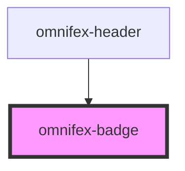

# omnifex-badge

<!-- Auto Generated Below -->

## Properties

| Property  | Attribute | Description | Type                                                                                                      | Default                  |
| --------- | --------- | ----------- | --------------------------------------------------------------------------------------------------------- | ------------------------ |
| `variant` | `variant` |             | `OmnifexVariant.INVERSE \| OmnifexVariant.PRIMARY \| OmnifexVariant.SECONDARY \| OmnifexVariant.TERTIARY` | `OmnifexVariant.PRIMARY` |

## Dependencies

### Used by

 - [omnifex-header](../header)

### Graph

----------------------------------------------

*Built with [StencilJS](https://stenciljs.com/)*
