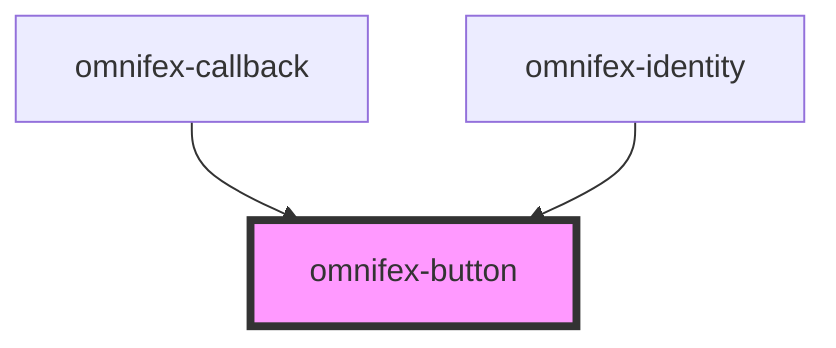

# omnifex-button

<!-- Auto Generated Below -->

## Properties

| Property     | Attribute    | Description | Type                                                                                                      | Default                    |
| ------------ | ------------ | ----------- | --------------------------------------------------------------------------------------------------------- | -------------------------- |
| `appearance` | `appearance` |             | `OmnifexAppearance.FILLED \| OmnifexAppearance.OUTLINED`                                                  | `OmnifexAppearance.FILLED` |
| `disabled`   | `disabled`   |             | `boolean`                                                                                                 | `false`                    |
| `type`       | `type`       |             | `"button" \| "reset" \| "submit"`                                                                         | `'button'`                 |
| `variant`    | `variant`    |             | `OmnifexVariant.INVERSE \| OmnifexVariant.PRIMARY \| OmnifexVariant.SECONDARY \| OmnifexVariant.TERTIARY` | `OmnifexVariant.PRIMARY`   |

## Events

| Event         | Description | Type                |
| ------------- | ----------- | ------------------- |
| `buttonClick` |             | `CustomEvent<void>` |

## Dependencies

### Used by

 - [omnifex-callback](../callback)
 - [omnifex-identity](../identity)

### Graph

----------------------------------------------

*Built with [StencilJS](https://stenciljs.com/)*
