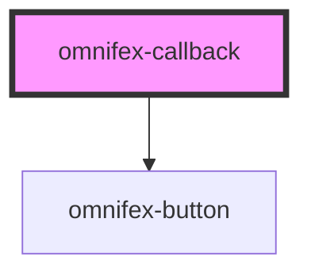

# omnifex-callback

<!-- Auto Generated Below -->

## Properties

| Property    | Attribute    | Description | Type             | Default |
| ----------- | ------------ | ----------- | ---------------- | ------- |
| `error`     | `error`      |             | `null \| string` | `null`  |
| `isLoading` | `is-loading` |             | `boolean`        | `false` |

## Events

| Event         | Description | Type                |
| ------------- | ----------- | ------------------- |
| `retry-click` |             | `CustomEvent<void>` |

## Dependencies

### Depends on

- [omnifex-button](../button)

### Graph

----------------------------------------------

*Built with [StencilJS](https://stenciljs.com/)*
