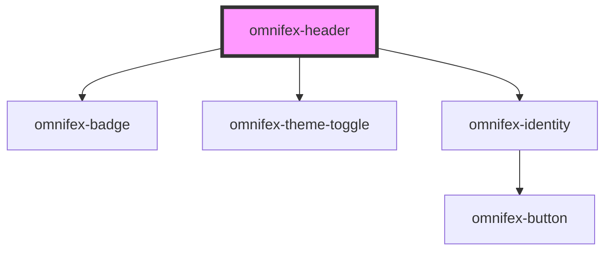

# omnifex-header

<!-- Auto Generated Below -->

## Properties

| Property          | Attribute          | Description | Type                 | Default     |
| ----------------- | ------------------ | ----------- | -------------------- | ----------- |
| `isAuthenticated` | `is-authenticated` |             | `boolean`            | `false`     |
| `isDark`          | `is-dark`          |             | `boolean`            | `false`     |
| `isLoading`       | `is-loading`       |             | `boolean`            | `false`     |
| `logoIcon`        | `logo-icon`        |             | `string`             | `'🅰️'`     |
| `logoText`        | `logo-text`        |             | `string`             | `'Omnifex'` |
| `roles`           | `roles`            |             | `string \| string[]` | `[]`        |
| `userName`        | `user-name`        |             | `string`             | `''`        |

## Events

| Event          | Description | Type                |
| -------------- | ----------- | ------------------- |
| `login-click`  |             | `CustomEvent<void>` |
| `logout-click` |             | `CustomEvent<void>` |
| `theme-toggle` |             | `CustomEvent<void>` |

## Dependencies

### Depends on

- [omnifex-badge](../badge)
- [omnifex-theme-toggle](../theme-toggle)
- [omnifex-identity](../identity)

### Graph

----------------------------------------------

*Built with [StencilJS](https://stenciljs.com/)*
