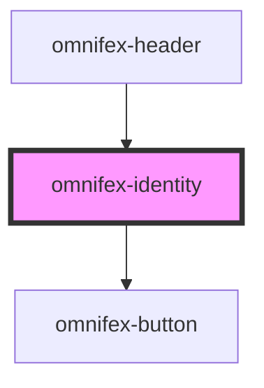

# omnifex-identity

<!-- Auto Generated Below -->

## Properties

| Property          | Attribute          | Description | Type      | Default |
| ----------------- | ------------------ | ----------- | --------- | ------- |
| `isAuthenticated` | `is-authenticated` |             | `boolean` | `false` |
| `isLoading`       | `is-loading`       |             | `boolean` | `false` |
| `userName`        | `user-name`        |             | `string`  | `''`    |

## Events

| Event          | Description | Type                |
| -------------- | ----------- | ------------------- |
| `login-click`  |             | `CustomEvent<void>` |
| `logout-click` |             | `CustomEvent<void>` |

## Dependencies

### Used by

 - [omnifex-header](../header)

### Depends on

- [omnifex-button](../button)

### Graph

----------------------------------------------

*Built with [StencilJS](https://stenciljs.com/)*
