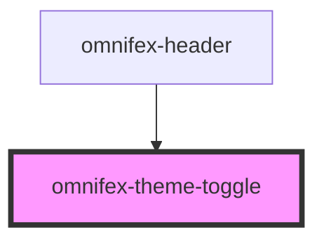

# omnifex-theme-toggle

<!-- Auto Generated Below -->

## Properties

| Property | Attribute | Description | Type      | Default |
| -------- | --------- | ----------- | --------- | ------- |
| `isDark` | `is-dark` |             | `boolean` | `false` |

## Events

| Event          | Description | Type                |
| -------------- | ----------- | ------------------- |
| `toggle-click` |             | `CustomEvent<void>` |

## Dependencies

### Used by

 - [omnifex-header](../header)

### Graph

----------------------------------------------

*Built with [StencilJS](https://stenciljs.com/)*
